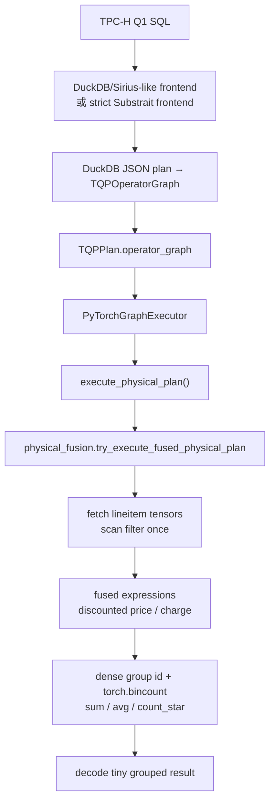

# torch-query-gpu

> 中文 README · TQP-style SQL analytics on PyTorch/CUDA tensors

`torch-query-gpu` 是一个**正确性优先**的 TQP 风格原型：从原始 SQL 出发，复用 DuckDB/Sirius-like 前端完成 SQL 解析与计划准入，再把计划交给 PyTorch 后端，在 CPU 或 CUDA tensor 上执行分析型查询。

```text
目标链路：SQL → DuckDB/Sirius-like Frontend → TQP IR → PyTorch/CUDA Operators → Result Rows
```

## 当前状态

- ✅ 默认链路支持 TPC-H Q1-Q22：原始 SQL → DuckDB `EXPLAIN (FORMAT JSON)` lowering → `TQPOperatorGraph` → PyTorch graph executor。
- ✅ CLI 能直接读取 `--query`、`--sql` 或 `--sql-file`，不需要手工导出 JSON。
- ✅ strict Substrait 路径仍可显式使用：`--frontend substrait`，只运行 DuckDB 原生 exporter 能导出的 SQL。
- ✅ Generic SQL subset 已支持单表 projection/filter/aggregate/order/limit。
- ✅ Q1-Q22 默认路径已迁入 DuckDB physical-plan interpreter：SQL → DuckDB JSON physical plan → `TQPOperatorGraph` → `execute_physical_plan()` → PyTorch tensor operators。
- ✅ Q2-Q22 已从早期 graph recipes 继续推进到 DuckDB physical-plan interpreter；旧 `queries/qXX` 模板和 `compiled_tpch` root 均不再作为执行 fallback。
- ✅ DuckDB physical-plan interpreter v1 已接入：Generic equi-join / join+group aggregate / final aggregate expression / basic HAVING / searched CASE / TOP_N 可从 SQL 直接 lowering 到 PyTorch；TPC-H Q1-Q22 已迁到该通用 interpreter，不再走 query-id recipe。
- ✅ 新增 physical-only TPC-H coverage probe：直接调用 `execute_physical_plan()` 衡量哪些 TPC-H 查询已脱离 graph recipe。
- ✅ Q6 有 correctness-first 压缩 mask 原型：`--compressed-masks`。
- ✅ 新增 CoddSpeed-style partitionable execution 原型：显式 `PartitionConfig` / `--partition-table lineitem --partition-chunk-size N`，当前覆盖单表 aggregate fragments（Q6、Q1），每个 chunk 仍走 DuckDB physical graph → PyTorch tensor operators，再由 host merge partial aggregates。
- ✅ 新增显式 scan chunk execution：`ScanChunkConfig(table, chunk_size)` 可把单表 scan/filter/project physical plan 切成多个 `TensorRecordBatch` chunk 执行；join/aggregate/sort/limit 等需要全局语义的 plan 会显式拒绝，不做静默整表 fallback。
- ✅ 论文驱动优化新增：physical SEMI/ANTI membership probe、sorted group-by `unique_consecutive` fast path、RLE `COUNT/SUM/MIN/MAX/AVG` primitive。
- ✅ Q1 hot benchmark 使用 per-connection resident tensor cache，warmup 后复用已转换 lineitem tensors；Q1 fused aggregation 使用 masked `torch.bincount`，避免 selected-row payload gather。
- ✅ 提供冷/热端到端 benchmark：`tpch-torch-benchmark`。
- ⚠️ 当前不是完整 SQL 数据库：frontend 能接收 DuckDB 可 parse/plan 的 SQL；PyTorch 后端已能解释一批 DuckDB physical plan nodes；basic HAVING 已支持，复杂 generic subquery/CTE/window/set operation 仍显式失败。

## 一图看懂架构

```mermaid
flowchart LR
    SQL["SQL / TPC-H Query<br/>--query / --sql / --sql-file"] --> Runner["runner.load_sql"]
    Runner --> Frontend{"frontend"}
    Frontend -->|默认 sirius| Sirius["DuckDB/Sirius-like Frontend<br/>Parser · Binder · Planner · Optimizer<br/>EXPLAIN metadata"]
    Frontend -->|显式 substrait| Substrait["DuckDB Native Substrait<br/>get_substrait_json(original_sql)"]
    Sirius --> Graph["DuckDB JSON physical plan<br/>→ TQPOperatorGraph"]
    Substrait --> IR["TQPPlan IR"]
    Graph --> IR["TQPPlan IR<br/>operator_graph boundary"]
    IR --> Backend["PyTorchBackend"]
    Backend --> GraphExec["PyTorchGraphExecutor.forward-like execute"]
    GraphExec -->|Q1-Q22 + generic joins| Physical["DuckDB physical-plan interpreter<br/>backend/physical*.py"]
    GraphExec -->|Q6 --compressed-masks| Primitives["Q6 compressed mask experimental primitive"]
    GraphExec -->|explicit PartitionConfig| Partitionable["CoddSpeed-style partitionable executor<br/>chunk scan · local aggregate · host merge"]
    GraphExec -->|explicit ScanChunkConfig| ScanChunk["scan chunk executor<br/>safe scan/filter/project chunks"]
    GraphExec -->|single-table generic subset| Generic["tpch_torch/backend/generic.py"]
    Physical --> Nodes["Physical tensor nodes<br/>Scan · Filter · Project · Join · Aggregate · Sort/TopN"]
    Primitives --> Torch["PyTorch Tensor Operators<br/>CPU / CUDA"]
    Partitionable --> Physical
    ScanChunk --> Physical
    Nodes --> Torch
    Generic --> Torch
    Torch --> Rows["Result Rows"]
    Rows -. correctness only .-> DuckDB["DuckDB baseline validation<br/>not a fallback"]
```



### 分层职责

| 层 | 模块 | 做什么 |
| --- | --- | --- |
| CLI | `scripts/run_query.py`, `scripts/validate_query.py`, `scripts/benchmark_query.py` | 接收 SQL 来源、frontend、device、benchmark 参数。 |
| Runner | `tpch_torch/runner.py` | 读取 SQL，编译 `TQPPlan`，调用后端，validation 时比较 DuckDB baseline。 |
| Frontend | `tpch_torch/frontend/sirius.py`, `tpch_torch/frontend/substrait.py` | 把原始 SQL 编译成 `TQPPlan`；默认是 Sirius-like DuckDB planner admission。 |
| IR | `tpch_torch/ir/plan.py` | 前端与后端之间的不可变边界对象。 |
| Backend | `tpch_torch/backend/pytorch.py`, `tpch_torch/backend/graph.py`, `tpch_torch/backend/generic.py`, `tpch_torch/backend/physical*.py` | 只通过 `TQPOperatorGraph` 进入 PyTorch graph executor；Q1-Q22 与 generic joins 可由 DuckDB physical-plan interpreter 执行；不执行 compiled TPC-H fallback root。 |
| Graph nodes / Operators | `tpch_torch/backend/graph_nodes.py`, `tpch_torch/backend/physical*.py`, `tpch_torch/operators.py`, `tpch_torch/compressed*.py` | Scan、filter、project、lookup/hash/equi join、membership-only semi/anti join、scalar/grouped scalar subquery、CTE、aggregate、sort/top-k、Plain/RLE/Index mask、RLE aggregate primitives、scan chunk execution，以及 partitionable chunk scan + host partial aggregate merge。 |

## Q1 是怎么实现的

Q1 当前走 graph-lowered fused physical primitive：DuckDB JSON physical plan 先被 lowering 成 `TQPOperatorGraph`，backend 进入 `execute_physical_plan()` 后由 `physical_fusion.py` 识别 canonical Q1 graph shape，并把 scan/filter/project/group/order 的重计算段融合为 dense-id grouped tensor reductions。未识别的 graph 仍显式走普通 physical interpreter。



关键代码位置：

- `tpch_torch/duckdb_plan_json.py`：DuckDB `EXPLAIN (FORMAT JSON)` lowering 到 `TQPOperatorGraph`。
- `tpch_torch/backend/graph.py`：`PyTorchGraphExecutor` 将 Q1-Q22 分发到 `execute_physical_plan()`。
- `tpch_torch/backend/physical.py`：解释 DuckDB physical nodes，并在入口调用 graph-lowered fusion hook。
- `tpch_torch/backend/physical_fusion.py`：识别 canonical Q1 graph shape，执行 fused dense-id grouped reductions。
- `tpch_torch/backend/physical_expr.py`：解释普通 physical path 中的 arithmetic / internal compress-decompress / projection ref 表达式。

```python
# tpch_torch/backend/pytorch.py
if plan.operator_graph is not None:
    return PyTorchGraphExecutor().execute(
        con, plan, device=device, use_compressed_masks=use_compressed_masks
    )
```

```python
# tpch_torch/backend/graph.py
if plan.query_id in _PHYSICAL_TPCH_QUERIES:  # Q1-Q22
    return execute_physical_plan(con, graph, device=device)

# tpch_torch/backend/physical.py
fused_rows = physical_fusion.try_execute_fused_physical_plan(...)
if fused_rows is not None:
    return fused_rows
```

## CoddSpeed-style partitionable execution

当前 engine 支持显式启用的 partitionable execution，用于模拟 CoddSpeed 中 host/coprocessor 按 chunk 执行 query fragment 的模型。默认执行路径不变；只有传入 `PartitionConfig` 或 benchmark CLI 参数时才启用。

```bash
python -m scripts.benchmark_query \
  --db data/tpch_sf1.duckdb \
  --query 6 \
  --device cpu \
  --cold-runs 0 --warmup-runs 1 --hot-runs 3 \
  --partition-table lineitem \
  --partition-chunk-size 100000
```

当前覆盖单表 aggregate physical fragments（例如 TPC-H Q6/Q1）：每个 chunk 通过同一个 DuckDB physical graph interpreter 调用 PyTorch tensor 算子，host 端再合并 `SUM/COUNT/MIN/MAX/AVG` partial aggregate。详细说明见 [`docs/partitionable-execution.zh.md`](docs/partitionable-execution.zh.md)。

## 显式 Scan Chunk Execution

`ScanChunkConfig` 用于把**单表 scan/filter/project** 查询按行范围切成多个 chunk。每个 chunk 仍从 SQL 编译出的 DuckDB physical graph 进入 `PhysicalPlanExecutor`，scan 产生带 `BatchMeta(chunk_size, chunk_index, source_offset)` 的 `TensorRecordBatch`，后续 filter/project 继续在 PyTorch tensor 上执行。

```python
import duckdb
from tpch_torch.backend.graph import PyTorchGraphExecutor
from tpch_torch.backend.physical_chunked import ScanChunkConfig
from tpch_torch.runner import compile_tqp_plan

con = duckdb.connect("data/tpch_sf1.duckdb")
sql = "select l_orderkey, l_quantity + 1 as q from lineitem where l_quantity < 24"
plan = compile_tqp_plan(con, sql, frontend="sirius")

rows = PyTorchGraphExecutor().execute(
    con,
    plan,
    device="cuda",
    scan_chunk_config=ScanChunkConfig(table="lineitem", chunk_size=100_000),
)
```

边界：

- ✅ 支持：一个 scan table 上的 scan/filter/project。
- ❌ 暂不支持：join、aggregate、sort、limit、CTE、delim/subquery 等跨 chunk 需要全局语义或状态合并的 plan。
- ✅ aggregate chunk 执行请继续使用 `PartitionConfig`，因为它带 partial aggregate host merge。
- ✅ 不支持的 plan 会抛 `UnsupportedPlanError`，不会静默退回整表执行。

## 安装

```bash
python3 -m venv .venv
. .venv/bin/activate
python -m pip install -U pip
python -m pip install -e '.[dev]'
```

## 生成 TPC-H 数据

```bash
# 默认 SF=1
python -m scripts.gen_sf1 --db data/tpch_sf1.duckdb --sf 1

# 或安装 editable 后使用 entrypoint
tpch-torch-gen-sf1 --db data/tpch_sf1.duckdb --sf 1
```

`scripts.gen_sf1` / `generate_tpch()` 会在调用 DuckDB `dbgen` 前设置
`PRAGMA threads=1`，避免容器 PID 额度紧张时 DuckDB 为测试数据生成启动过多
worker。需要更高并发时可显式设置，例如：

```bash
TQG_DUCKDB_THREADS=8 python -m scripts.gen_sf1 --db data/tpch_sf1.duckdb --sf 1
```

## 运行与验证

### 运行单个 TPC-H 查询

```bash
tpch-torch-run \
  --db data/tpch_sf1.duckdb \
  --query 1 \
  --device cuda \
  --frontend sirius
```

没有 CUDA 的机器请使用 `--device cpu`。如果显式请求 `--device cuda` 但 PyTorch 检测不到 CUDA，命令会直接报错，不会静默回退到 CPU。

### 验证单个查询

```bash
tpch-torch-validate \
  --db data/tpch_sf1.duckdb \
  --query 1 \
  --device cuda \
  --frontend sirius
```

Validation 会运行同一条 PyTorch 链路，并把结果与 DuckDB 对同一条原始 SQL 的执行结果比较。DuckDB 只用于 baseline，不是 fallback 输出。

### 直接运行 SQL 文本或 SQL 文件

```bash
tpch-torch-validate \
  --db data/tpch_sf1.duckdb \
  --sql "select count(*) as n from lineitem" \
  --device cuda

cat queries/my_query.sql | sed -n '1,120p'
tpch-torch-run \
  --db data/tpch_sf1.duckdb \
  --sql-file queries/my_query.sql \
  --device cuda
```

当前 generic SQL 支持分两层：

1. `backend/generic.py`：单表 SQL parser/executor。
2. `backend/physical.py`：DuckDB JSON physical-plan interpreter v1，直接解释 DuckDB plan nodes。

已支持：

```text
single-table SELECT
WHERE comparisons / IN / LIKE / NOT LIKE / AND / OR / NOT
column projection、nested SELECT alias、EXTRACT(year FROM date)、searched/simple CASE 与简单 arithmetic projection
COUNT(*), COUNT(col), SUM, MIN, MAX, AVG
simple GROUP BY
basic HAVING over aggregate aliases / aggregate expressions
ORDER BY output columns ASC / DESC
LIMIT / duplicate-free single-key TOP_N tensor top-k path
DuckDB physical SEQ_SCAN / FILTER / PROJECTION
DuckDB physical HASH_JOIN inner / multi-column equi-join（correctness-first）
DuckDB physical HASH_GROUP_BY / PERFECT_HASH_GROUP_BY / UNGROUPED_AGGREGATE
DuckDB physical ORDER_BY / TOP_N / LIMIT（无重复 key 的单 key TOP_N 使用 torch.topk）
final aggregate expression alias，例如 100 * sum(x) / sum(y)；支持 aggregate alias/order 归一化
```

本轮算子优化已覆盖 physical-plan interpreter 的几条热路径：

- `HASH_JOIN` row-index 生成从 Python `dict/list/tolist()` 改为 tensor `searchsorted` 路径；右侧 build key 已排序且唯一时跳过 `argsort` 和重复展开。
- P0 正确性修复：浮点 join key 不再被截断为 `int64`；整数 `MIN/MAX` 使用 dtype-safe sentinel；`PhysicalValue.valid` 已接入基础 NULL-aware boolean / string predicate / aggregate 语义。
- `PhysicalValue` 携带 conservative sorted/unique metadata；scan/filter/single-key
  sort/single-key group-by 会传播这些属性，PK/FK join 可直接走
  sorted-unique build lookup，避免重复探测 sortedness。
- 已知 TPC-H 低基数字符串列使用 table-aware static dictionary encoding，避免大列上反复 `numpy.unique`。
- `IN` / 同列 literal `OR` 使用 membership mask；singleton membership 直接走 equality。
- `PhysicalTable.filter/gather` 对共享 alias 的 `PhysicalValue` 只转换一次，减少 physical plan 中 `col` / `table.col` alias 的重复 tensor selection。
- 本批新增通用 physical lowering：multi-column equi-join、CAST wrapper、NOT LIKE (`!~~`)、nested SELECT alias、EXTRACT(year)、parent-required join key retention、aggregate ORDER BY alias matching、basic HAVING、multi-branch/simple CASE、duplicate-free single-key TOP_N tensor top-k。

### 验证全部 TPC-H

```bash
tpch-torch-validate \
  --db data/tpch_sf1.duckdb \
  --queries all \
  --device cuda \
  --frontend sirius \
  --keep-going
```

这条命令走完整默认链路：**SQL → DuckDB/Sirius-like frontend → TQPPlan → PyTorch backend**。

当前回归验证还覆盖 recipe-disabled physical-only smoke：在旧 `tpch_graph_qXX`
函数被 monkeypatch 为失败的情况下，TPC-H Q1-Q22 均可通过 DuckDB physical
plan interpreter 执行；Q17 额外在 SF=1 / CPU 上验证 correlated scalar
subquery + `l_extendedprice` positional projection 的数值正确性。

### Strict Substrait 路径

```bash
tpch-torch-run \
  --db data/tpch_sf1.duckdb \
  --query 6 \
  --device cuda \
  --frontend substrait \
  --json

# 探测 DuckDB 原生 Substrait exporter 当前覆盖情况
tpch-torch-probe-substrait --db data/tpch_sf1.duckdb --queries all --json
```

Substrait 策略：

```text
original SQL
  -> DuckDB get_substrait_json(original_sql)
  -> TQPPlan carrying real Substrait JSON
  -> PyTorch backend
```

如果 DuckDB exporter 导不出原始 SQL，该路径会显式失败；项目不会改写 SQL、伪造 JSON 或自动切到 Sirius-like 路径。

### Q6 压缩 mask 原型

```bash
tpch-torch-run \
  --db data/tpch_sf1.duckdb \
  --query 6 \
  --device cuda \
  --compressed-masks

tpch-torch-validate \
  --db data/tpch_sf1.duckdb \
  --query 6 \
  --device cuda \
  --compressed-masks
```

`--compressed-masks` 当前只改变 Q6 的 PyTorch predicate mask 执行方式：Plain/RLE/Index mask dispatch。它还不是完整压缩列存储或压缩 join/aggregate 执行。

## 冷/热性能计时

```bash
tpch-torch-benchmark \
  --db data/tpch_sf1.duckdb \
  --query 1 \
  --device cuda \
  --frontend sirius \
  --cold-runs 3 \
  --warmup-runs 5 \
  --hot-runs 20

# JSON 输出，便于脚本收集
tpch-torch-benchmark \
  --db data/tpch_sf1.duckdb \
  --query 6 \
  --device cuda \
  --compressed-masks \
  --json
```

计时语义：

- **cold**：每个样本新建 DuckDB connection，运行完整 frontend + tensor fetch/encoding + PyTorch backend + result materialization，再关闭连接。不刷新 OS page cache，也不重启 Python。
- **hot**：复用一个 DuckDB connection，先执行 `--warmup-runs`，再记录 `--hot-runs`；Q1 的 lineitem tensor table 会在该连接内常驻复用，更接近 TQP 论文中“数据已转换为 PyTorch tensors 后测 query execution”的口径。
- **CUDA**：每个样本前后调用 `torch.cuda.synchronize()`，报告 wall-clock ms，因此包含 CPU 侧 frontend/fetch/materialization 与 GPU work。
- Benchmark 不做 DuckDB validation；正确性请单独运行 `tpch-torch-validate`。

### 最近一次 Q1 性能对比（SF=1）

同一台机器（CPU + RTX 4090），命令均为 `--cold-runs 3 --warmup-runs 3 --hot-runs 10 --frontend sirius`。计时为端到端 wall-clock，包含 DuckDB frontend、tensor fetch/encoding、PyTorch 执行和结果 materialization；未刷新 OS page cache。

| 版本 | device | cold median | hot median | 变化（hot median） |
| --- | --- | ---: | ---: | ---: |
| `c8b3bd9`（full graph recipes merge 前） | CPU | 794.123 ms | 794.571 ms | baseline |
| 当前 physical-interpreter 分支 | CPU | 973.831 ms | 904.851 ms | +13.9% |
| `c8b3bd9`（full graph recipes merge 前） | CUDA | 675.461 ms | 650.313 ms | baseline |
| 当前 physical-interpreter 分支 | CUDA | 745.996 ms | 703.522 ms | +8.2% |

注意：该历史表是在 Q1 迁入 physical interpreter 之前记录的 direct primitive 路径数据。Q1 现在已经改为 SQL-lowered physical interpreter 路径，后续需要重新建立新的冷/热性能基线。

### 当前算子优化 smoke benchmark（SF=1）

命令均为 `--cold-runs 1 --warmup-runs 1 --hot-runs 3 --frontend sirius --device cpu`，计时端到端且较短，仅用于确认优化方向：

| Query | 优化前 hot median | 优化后 hot median | 说明 |
| --- | ---: | ---: | --- |
| Q12 | 2293.140 ms | 2049.648 ms | static dictionary + alias 去重；join 仍受 row expansion 影响 |
| Q14 | 857.160 ms | 703.668 ms | sorted unique build-side join fast path |
| Q19 | 2111.015 ms | 1744.495 ms | tensor join + membership/OR 折叠 + alias 去重 |

Q1 已在后续改为 DuckDB physical-plan interpreter 路径；上表 smoke benchmark 主要覆盖 Q12/Q14/Q19 和 generic physical-plan 算子优化。

2026-07-02 metadata batch 复测（SF=1 CPU，`--cold-runs 0 --warmup-runs 1 --hot-runs 3`，
短样本端到端）：Q14 main/branch hot median 519.374/534.547 ms，Q19 main/branch hot
median 1567.334/1484.621 ms。结论：metadata path 已接入但短样本收益混合，Q19 有小幅改善，
Q14 受 frontend/fetch/materialization 噪声影响未显示稳定收益。

### Q1 graph-lowered fusion smoke benchmark（SF=1）

命令均为 `--query 1 --frontend sirius --cold-runs 1 --warmup-runs 1 --hot-runs 5`，计时端到端且样本很短，仅用于确认优化方向：

| 版本 | device | cold median | hot median | 说明 |
| --- | --- | ---: | ---: | --- |
| 普通 physical interpreter | CPU | 8969.746 ms | 9345.923 ms | generic projection/groupby path |
| Q1 fusion：dense grouped reductions | CPU | 1515.715 ms | 1114.154 ms | 仍每次 DuckDB→tensor fetch |
| Q1 resident + masked bincount | CPU | 943.278 ms | 198.580 ms | hot 复用 resident tensors，aggregation 不做 payload gather |
| Q1 resident + masked bincount | CUDA | 719.700 ms | 12.365 ms | hot 接近 TQP 论文 execution-time 口径；cold 仍含首次 DuckDB→GPU tensor conversion |

该优化没有绕过 SQL lowering：Q1 仍从 DuckDB JSON physical plan 进入 `TQPOperatorGraph`，只是 physical backend 在 graph shape 上选择 fused primitive。论文中 TQP 报告的是输入列已离线转换为 PyTorch tensors 后的 query execution time；因此应主要看 hot/resident 结果，cold 结果用于暴露 ingestion/transfer 成本。


## TPC-H 支持矩阵

| Query set | 默认 Sirius-like frontend | Strict DuckDB Substrait frontend | PyTorch backend | 当前后端形态 |
| --- | --- | --- | --- | --- |
| Q1-Q22 | yes | partial; DuckDB exporter still blocks several complex queries | yes | DuckDB physical-plan interpreter v1 by default |
| Q6 `--compressed-masks` | yes | yes | yes | explicit compressed-mask primitive experiment |

说明：strict Substrait 的 blocked 是 DuckDB 原生 exporter 覆盖限制，不代表 PyTorch backend 没有这些查询的 executor。默认 Sirius-like 路径下 Q1-Q22 都先 lowering 到 `TQPOperatorGraph` 再进入 PyTorch backend。

## Roadmap 摘要

完整清单见：

- 中文执行版：[`docs/operator-roadmap.zh.md`](docs/operator-roadmap.zh.md)
- 英文原版：[`docs/operator-roadmap.md`](docs/operator-roadmap.md)

当前批次状态：

- [x] TPC-H Q1-Q22 通过 DuckDB JSON physical plan lowering 到 `TQPOperatorGraph` 后进入 PyTorch graph executor。
- [x] Strict DuckDB Substrait path：覆盖 DuckDB exporter 能导出的查询。
- [x] Batch 1 primitives：grouped min/max/mean、mask helpers、top-k、首批 RLE mask primitives。
- [x] Batch 2 部分 generic SQL：`MIN`、`MAX`、`AVG`、`COUNT(col)`、boolean filters、`IN`、`LIKE`、basic `HAVING`、generic `CASE`、`ORDER BY ASC/DESC`、duplicate-free single-key top-k `LIMIT`。
- [x] Q1 已增加 graph-lowered fused physical primitive：仍由 SQL/DuckDB graph 触发；hot path 复用 resident tensors，并用 masked `torch.bincount` 做融合聚合。
- [x] Q6 默认路径已迁到 DuckDB physical-plan interpreter；`--compressed-masks` 保留显式 compressed mask primitive 实验。
- [x] Generic equi-join / join+aggregate / final aggregate expression 已通过 DuckDB physical-plan interpreter v1 跑通。
- [x] Physical-plan 算子热路径优化：tensor join index、sorted/unique metadata、PK/FK sorted-unique build fast path、SEMI/ANTI membership probe、sorted group-by fast path、static dictionary encoding、membership mask、alias 去重 gather/filter。
- [ ] Generic subquery lowering、window、set operations；更复杂 `HAVING` / `CASE` SQL shapes 继续扩展。
- [x] 压缩数据第一批 aggregate primitive：RLE `COUNT` / `SUM` / `MIN` / `MAX` / `AVG` 基于 run lengths 执行，不展开 rows。
- [ ] 完整 compressed storage metadata、encoded column execution、compressed aggregation/join。
- [x] 第一版显式 `TQPOperatorGraph` 与 DuckDB JSON lowering。
- [x] Q2-Q22 默认 physical interpreter coverage 已跑通；历史 graph recipe 源码不再作为默认执行路径。
- [x] Q1-Q22 默认路径已从旧 query-id dispatch 迁到 DuckDB physical-plan interpreter。
- [x] 新增 `tpch_torch.physical_coverage`，用于探测 TPC-H physical-only 自动算子覆盖；当前 Q1-Q22 全部 supported。
- [x] 第一批 graph-lowered fusion：Q1 scan/filter/project/group/order fused dense grouped reductions。
- [ ] 更多 fusion、scheduling、compiler lowering。

## 文档导航

| 文档 | 内容 |
| --- | --- |
| [`docs/architecture.zh.md`](docs/architecture.zh.md) | 中文架构说明、关键代码片段、Q1 分层图。 |
| [`docs/q1-end-to-end-execution.zh.md`](docs/q1-end-to-end-execution.zh.md) | 以 TPC-H Q1 为例，详细解释 SQL 解析、DuckDB JSON physical plan、TQPOperatorGraph、PyTorch backend/operator 与冷/热执行口径。 |
| [`docs/gpu-sql-ecosystem-analysis.zh.md`](docs/gpu-sql-ecosystem-analysis.zh.md) | 对比 RAPIDS/cuDF/RMM、Sirius-like 前端、TQP/TQP++/CoddSpeed 与本项目 PyTorch 路线，分析软件栈、显存管理和复用 CUDA 算子的工程取舍。 |
| [`docs/gpu-db-engine-assessment.zh.html`](docs/gpu-db-engine-assessment.zh.html) | 可浏览 HTML：评估 GPU 数据库引擎为什么难写，以及当前简化 TQP/PyTorch 版本距离成熟引擎还需要补齐的能力。 |
| [`docs/ai-tensor-db-on-domestic-gpu.zh.md`](docs/ai-tensor-db-on-domestic-gpu.zh.md) | 面向分享的完整视图：以当前 demo、TQP 和 CoddSpeed 为参考，说明如何在国产卡上复用 AI tensor / PyTorch 生态实现关系代数与数据库执行。 |
| [`docs/tqp-coddspeed-pytorch-runtime-notes.zh.md`](docs/tqp-coddspeed-pytorch-runtime-notes.zh.md) | 补充说明：TQP/TQP++/CoddSpeed 复用 PyTorch/TCR 的能力边界，以及 PyTorch CPU/GPU kernel 并行、streams、DataLoader 与 graph/compiler fusion 的层次。 |
| [`docs/architecture.md`](docs/architecture.md) | 英文架构说明。 |
| [`docs/operator-roadmap.zh.md`](docs/operator-roadmap.zh.md) | 中文 Roadmap / TODO。 |
| [`docs/operator-roadmap.md`](docs/operator-roadmap.md) | 英文完整 Roadmap。 |
| [`docs/papers/README.md`](docs/papers/README.md) | 论文总索引、下载状态、跨论文 synthesis，以及 TQP/TQEx/CoddSpeed 精读笔记入口。 |

## 开发验证

```bash
# 单元测试，后端测试建议保持 60 秒 timeout
timeout 60 python -m pytest -q

# Python 文件语法检查
timeout 60 python -m compileall -q tpch_torch scripts
```

# TODO
## TQP 当前 TODO 总览

### P0 — 正确性（已完成）

1. [x] 浮点 join key 截断：`physical_join.py` 强制 `.to(int64)` 导致浮点 key 被截断
2. [x] MIN/MAX 初始化：`_scatter_reduce` 用 `float("inf")` 初始化整数张量
3. [x] NULL 语义缺失：无 NULL-aware 布尔和聚合语义

### P1 — TensorRecordBatch + 类型系统

4. [x] 新增 `TensorRecordBatch` + `ColumnMeta`（dtype/scale/nullable）
5. [x] DuckDB → PyTorch dtype 映射表
6. [x] scan→filter→projection 链路改造，输出列携带正确 `ColumnMeta`
7. [x] 扩展至 INT64 / FP32 / FP64 / DECIMAL(int64+scale)
8. [x] projection 多精度表达式第一版：DECIMAL arithmetic/comparison/CASE/scalar-subquery
   已走 metadata-aware tensor path；AST 深度×宽度压力矩阵仍保留为扩展测试项
9. [x] 变长数据管理第一版：string 字典动态扩容，并保留已有 dictionary id
10. [x] scan chunk execution 第一版：`ScanChunkConfig` 显式切分单表 scan/filter/project，并把 configured chunk metadata 写入 `TensorRecordBatch.batch_meta`

### P2 — Join/Agg 多精度

11. [x] sort/searchsorted inner join 扩展至 INT64/FP32/FP64/DECIMAL(scale-aligned)
12. [x] group-by SUM/MIN/MAX/AVG 扩展至 INT64/FP32/FP64/DECIMAL；DECIMAL AVG 输出真实 fp64
13. [x] join 第一批测试：INT64/FP32/FP64/DECIMAL key 覆盖；完整 key/payload 矩阵待扩展
14. [x] agg 第一批测试：INT64/FP32/FP64/DECIMAL SUM + DECIMAL MIN/MAX/AVG；完整多 key/SUM 矩阵待扩展
15. [x] hash-style join 第一版接口：tensor dictionary/probe prototype（不是成熟 GPU hash table）
16. [x] hash join 第一批测试：DECIMAL scale-aligned probe；完整 key/payload 矩阵待扩展

### P3 — 压缩数据执行（远期）

17. RLE 列存储、composite encoding（Plain+Index / RLE+Index）
18. 压缩数据 alignment、compressed join/agg
19. 压缩感知 optimizer rules、encoding 选择策略

### P4 — 编译器/融合/优化（远期）

20. 更多 fusion passes（projection/filter/agg 链）
21. `torch.compile` / Antares / TVM 编译执行
22. hash join vs sort join 自适应选择
23. sorted/unique 元数据感知优化
24. hot path 去 Python loops

### P5 — 论文对齐（远期）

25. TQEx：irregular SQL 与 tensor 的 gap 建模、multi-device
26. TQP++：ML-compiler lowering、tiered scheduling
27. CoddSpeed：数据移动建模、accelerator placement

---

**本次任务范围：P1 + P2 第一版已落地，目标是功能正确优先；成熟 GPU hash table 与完整压力矩阵仍在 P4/P2 扩展项中跟踪。**

当前类型层实现要点：

- `tpch_torch/record_batch.py` 提供 `TensorRecordBatch`、`ColumnMeta`、`LogicalDType`。
- `tpch_torch/backend/type_mapping.py` 负责 DuckDB type → PyTorch dtype / `ColumnMeta`，其中 `DECIMAL(p,s)` 表示为 `torch.int64 + scale=s`。
- `PhysicalValue.meta` 让现有 physical executor 在 scan/filter/gather/projection/join/agg 中保留 logical dtype。
- `physical_decimal_expr.py` 负责 DECIMAL 与 literal / numeric tensor 的 scale 对齐、CASE 合并和 scalar-subquery 比较。

## TensorRecordBatch / 多精度 / Join-Agg 任务分解与验收矩阵

完整设计文档：[`docs/plans/2026-07-09-tensor-record-batch-v2-design.md`](docs/plans/2026-07-09-tensor-record-batch-v2-design.md)。该文档按“外部实现调研 → 当前 TQP 落点评估 → 最终 ABI/AST/变长数据/lifecycle 方案 → 分阶段 TODO”组织。

> 任务背景：在已有 TQP physical-plan interpreter 基础上，把关系数据进一步抽象为 typed tensor batch，并补齐数据库常见数值精度、变长数据、join/agg、多 GPU/offload 验证和论文对齐。候选协作人：@georgism(DAVID ZHELIANG LIAO)、@ziliangzhu(朱梓良)。

### 1. 已有实现评估

| 方向 | 当前状态 | 关键代码 / 测试 | 缺口 |
| --- | --- | --- | --- |
| `TensorRecordBatch` / `ColumnMeta` | 已有第一版 typed columnar batch，可 `filter/gather/project` 保留 metadata/validity。 | `tpch_torch/record_batch.py`, `tests/test_record_batch.py` | 还未作为所有 physical operator 的唯一数据边界；当前仍与 `PhysicalTable` / `PhysicalValue` 兼容共存。 |
| DuckDB → PyTorch dtype mapping | 已支持 BIGINT/INTEGER、FLOAT、DOUBLE、BOOLEAN、DATE、VARCHAR、DECIMAL(p,s)。 | `tpch_torch/backend/type_mapping.py`, `tests/test_type_mapping.py` | 需要补齐更多 DuckDB 类型、nullable/overflow policy、decimal precision 上限策略。 |
| Filter / projection metadata | scan/filter/gather/projection 已能传播 `PhysicalValue.meta`；DECIMAL 表达式走 metadata-aware path。 | `physical_scan.py`, `physical_expr.py`, `physical_decimal_expr.py`, `tests/test_decimal_physical.py` | projection 压力测试矩阵不足：复杂单表达式嵌套深度、同时多表达式宽度、mixed decimal/literal/float/int 组合仍需系统化覆盖。 |
| 多精度数值 | 已覆盖 INT64 / FP32 / FP64 / DECIMAL(int64+scale) 第一版。 | `tests/test_p2_multi_precision.py` | 需要明确 DECIMAL overflow/rounding/scale promotion 规则；division 目前 correctness-first 输出 fp64。 |
| 变长数据 | 已有 string dictionary 动态扩容 helper，并保留已有 dictionary id。 | `encode_strings_dynamic()` | 还缺 offset/value 形式的变长字符串、dictionary merge、LIKE/prefix/substring 的 batch-level 测试矩阵和 GPU offload 口径。 |
| Sort/searchsorted join | 单列 inner join 已支持 INT64/FP32/FP64/DECIMAL scale alignment；multi-condition join 先候选再 tensor filter。 | `physical_join.py`, `physical_key_ops.py` | 还缺完整 sort-based multi-key join 设计：key packing、payload 多列 late materialization、duplicate/null 矩阵、join-index 输出。 |
| Group-by / aggregate | SUM/MIN/MAX/AVG 已支持多精度第一版；DECIMAL SUM/MIN/MAX 保留 meta，AVG 输出 fp64。 | `physical_aggregate.py` | 还缺 single group-by 多 key / 多 SUM 系统矩阵；COUNT DISTINCT、STD/VAR、nullable decimal 的完整规则。 |
| Hash join | 已有 hash-style tensor dictionary/probe prototype。 | `physical_hash_join.py` | 不是成熟 GPU hash table；需要基于 cuDF/TQP/CoddSpeed 调研并实现 build/probe/collision/duplicate 输出索引。 |
| GPU offload | physical executor 支持 device=`cuda`，已有 Q1-Q22 recipe-disabled smoke。 | runner / physical tests | 需要每个新算子都有 CPU/GPU 双路径测试，断言 tensor device，禁止隐式 CPU fallback。 |

### 2. Filter / Projection + TensorRecordBatch 类型系统任务

#### 2.1 方案

- 以 `TensorRecordBatch` 作为下一阶段 operator 边界：`columns[name] -> torch.Tensor`，`meta[name] -> ColumnMeta`，`validity[name] -> bool mask`。
- 保留 `PhysicalTable` 兼容层，但新增算子优先以 `TensorRecordBatch` API 实现，再由 physical executor 做适配。
- DECIMAL 继续采用 `int64 + scale`：
  - `+/-`：scale 对齐到 max scale。
  - `*`：scale 相加，precision 保守传播。
  - `/`：先保持 correctness-first 输出 fp64；若后续需要 SQL decimal rounding，再单独设计。
- String 变长数据分两层：
  - 低基数字符串：dictionary encoded int64 ids。
  - 真正变长字符串：后续引入 `offsets + values` / dictionary + overflow vocabulary，避免 Python object array 进入 hot path。

#### 2.2 设计任务

| ID | 优先级 | 任务 | 产出 |
| --- | --- | --- | --- |
| TRB-01 | P0 | 将 filter/projection primitive 抽象成 `TensorRecordBatch -> TensorRecordBatch`，保留 meta/validity。 | `tpch_torch/record_batch_ops.py` 或同等模块；适配 tests。 |
| TRB-02 | P0 | 建立 DuckDB 类型映射表的完整文档与测试 fixture。 | BIGINT/INTEGER/FLOAT/DOUBLE/DECIMAL/VARCHAR/DATE/BOOLEAN/nullable coverage。 |
| TRB-03 | P0 | projection arithmetic expression 支持 INT64/FP32/FP64/DECIMAL 混合表达式。 | metadata-aware expression evaluator；scale alignment 测试。 |
| TRB-04 | P1 | projection 多表达式批量执行接口，避免每个表达式重复 materialize 中间列。 | expression list evaluator；可记录 intermediate reuse。 |
| TRB-05 | P1 | 明确 DECIMAL overflow / rounding / scale promotion policy。 | README + tests；必要时显式抛错，不静默降级。 |
| TRB-06 | P1 | string dictionary dynamic expansion 完整化：merge、gather/filter 后 dictionary 稳定、unknown value error policy。 | string dictionary tests。 |
| TRB-07 | P2 | 引入变长字符串 `offsets + values` 表示，参考 TQP/TQEx 对 variable-length data 的 gap 分析。 | `StringColumnMeta` / storage prototype。 |

#### 2.3 Projection 测试矩阵

| 维度 | 覆盖要求 |
| --- | --- |
| dtype | INT64、FP32、FP64、DECIMAL(scale=0/2/4)、mixed literal。 |
| 表达式深度 | depth=1/2/3/4，例如 `a+b`、`a*(b-c)`、`(a+b)*(c-d)/e`。 |
| 表达式宽度 | 同时 projection 1 / 4 / 16 / 64 个表达式。 |
| NULL/validity | no-null、single-null、all-null、mixed validity。 |
| DECIMAL scale | same scale、different scale、literal scale、乘法 scale 增长、除法 fp64。 |
| 设备 | CPU + CUDA；CUDA 不可用时测试应显式 skip，不允许静默 fallback。 |
| oracle | DuckDB SQL baseline + 手写小张量 expected values 双重校验。 |
| offload 断言 | 输出 tensor device 与输入一致；测试中 monkeypatch/断言禁止 `.cpu().tolist()` 进入 hot path。 |

#### 2.4 TensorRecordBatch v2 结构设计补充

`TensorRecordBatch` 不应只是一组 `name -> tensor`，而应该成为 physical operator 之间唯一的 typed columnar ABI。建议把下一版拆成四层元数据：

| 层次 | 必备字段 | 说明 |
| --- | --- | --- |
| Batch metadata | `row_count`, `chunk_size`, `chunk_index`, `source_offset`, `device`, `schema_version` | 描述当前 chunk 的行数、来源位置、目标 device；chunk 大小与 DB vector/chunk 概念对齐，便于后续 pipeline scheduling。 |
| Schema / DuckDB type | `name`, `duckdb_type_id`, `duckdb_type_repr`, `nullable`, `logical_dtype` | 必须保留 DuckDB 类型语义，例如 `DECIMAL(15,2)`、`VARCHAR`、`DATE`，不能只剩 PyTorch dtype。 |
| Physical storage | `storage_kind`, `torch_dtype`, `scale`, `precision`, `children` | 描述实际 tensor 表示：fixed-width、decimal int64+scale、dictionary ids、offsets+values 等。 |
| Runtime / lifecycle | `owner`, `is_view`, `parent_batch_id`, `stream`, `memory_resource` | 第一阶段使用 PyTorch tensor 引用计数管理生命周期；后续接入外部 CUDA/DLPack/cuDF buffer 时再启用 explicit owner/resource。 |

参考 cuDF/libcudf 的设计，`column` 持有 data buffer、null mask 和 child columns；`column_view` 是不拥有内存的 view；字符串列是 compound column，由 packed chars buffer 与 offsets child 表达，父列的 size 仍是字符串行数，null mask 表示每行字符串有效性。当前项目不需要立即复刻 RMM，但应预留 `MemoryResource` / `AllocationOwner` 字段，避免后续接外部 GPU buffer 时破坏 ABI。

参考资料：[libcudf `column`](https://docs.rapids.ai/api/libcudf/stable/classcudf_1_1column/)、[libcudf `column_view`](https://docs.rapids.ai/api/libcudf/stable/classcudf_1_1column__view/)、[libcudf column factories / strings column](https://docs.rapids.ai/api/libcudf/stable/group__column__factories/)、[RMM](https://docs.rapids.ai/api/rmm/stable/)。

推荐的 Python 侧形态：

```python
@dataclass(frozen=True)
class ColumnType:
    duckdb_type_id: str           # DECIMAL, VARCHAR, BIGINT, ...
    duckdb_type_repr: str         # DECIMAL(15,2), VARCHAR, DATE
    logical_dtype: LogicalDType   # DECIMAL / STRING / INT64 / FP32 ...
    nullable: bool
    precision: int | None = None
    scale: int | None = None

@dataclass(frozen=True)
class ColumnStorage:
    kind: StorageKind             # FIXED, DECIMAL64, DICTIONARY, UTF8_OFFSETS
    data: torch.Tensor            # values / dictionary ids / chars buffer
    validity: torch.Tensor | None # row-level bool mask
    children: Mapping[str, torch.Tensor] = field(default_factory=dict)
    owner: AllocationOwner | None = None

@dataclass(frozen=True)
class TensorRecordBatch:
    columns: Mapping[str, ColumnStorage]
    types: Mapping[str, ColumnType]
    row_count: int
    chunk_size: int
    chunk_index: int
    source_offset: int
    device: torch.device
```

落地原则：

- fixed-width 数值列：`data.shape[0] == row_count`。
- DECIMAL：`data=torch.int64`，类型层保留 `precision/scale/duckdb_type_repr`。
- dictionary string：`data=torch.int64 ids`，children/meta 中保留 vocabulary；适合 TPC-H 低基数字符串。
- UTF8 varlen：`children["offsets"]` 长度为 `row_count + 1`，`data` 或 `children["chars"]` 是 packed `uint8` 字节；filter/gather 后必须 compact offsets/chars 或显式标记为 view。
- 生命周期：默认不可变、算子返回新 batch；view 型 batch 必须记录 parent，禁止悬垂外部 buffer；没有外部 buffer 时不增加手工 `close()`。

新增 TODO：

| ID | 优先级 | 任务 | 完成标准 |
| --- | --- | --- | --- |
| TRB-08 | P0 | `ColumnMeta` 拆分/扩展为 DuckDB logical type + physical storage。 | `DECIMAL(15,2)`、`VARCHAR`、`DATE` 等 DuckDB 类型可 round-trip；原测试通过。 |
| TRB-09 | P0 | 在 batch 层加入 `row_count/chunk_size/chunk_index/source_offset/device`。 | scan/filter/project/gather 后 chunk metadata 明确更新。 |
| TRB-10 | P1 | 引入 owning/view lifecycle 标记。 | filter/gather/project 可区分 copy 与 view；外部 buffer 接入点有测试。 |
| TRB-11 | P1 | UTF8 offsets+chars storage prototype。 | 支持 varlen filter/gather/project，覆盖 empty/null/basic unicode。 |

#### 2.5 Filter / Projection 表达式 AST 与优化设计

filter/projection 不应长期停留在“递归解释 DuckDB 表达式并即时执行 tensor op”的形态。推荐链路：

```text
DuckDB logical/physical expression
        ↓ bind/type inference
Typed Expression AST
        ↓ normalize + optimize
Expression DAG
        ↓ lower
Tensor primitive plan
        ↓ execute on torch device
TensorRecordBatch
```

优化重点：

| 优化 | 作用 | 第一阶段范围 |
| --- | --- | --- |
| Type binding | 每个 AST node 标注 DuckDB 类型、PyTorch dtype、decimal scale、nullable。 | P0 |
| Constant folding | `l_discount < 0.10 + 0.01` 这类常量提前算好。 | P0 |
| Decimal scale hoisting | 表达式树中统一 scale 对齐，避免每层重复乘 10。 | P0 |
| Common sub-expression elimination | 多 projection 共享 `l_extendedprice * (1-l_discount)` 等中间结果。 | P0 |
| Predicate normalization | AND/OR/NOT、BETWEEN、IN 统一成 mask DAG。 | P1 |
| Projection batch execution | 多表达式一次性 lower，统一 intermediate cache 和 validity propagation。 | P1 |
| Numeric fusion | 纯数值 DAG 后续可尝试 `torch.compile` / custom kernel 融合。 | P2 |
| String fast path | dictionary string equality/IN/prefix 优先走 id/set tensor op。 | P1 |

AST 设计要求：

- AST node 是不可变对象，包含 `op`, `children`, `literal`, `bound_type`, `nullable`。
- lowering 只生成 tensor primitive，不允许在 hot path 做 row-level Python loop。
- 每个 primitive 明确 CPU/CUDA 支持矩阵；CUDA 不可用只能 skip 测试，不能静默 fallback。
- 对 DECIMAL overflow/rounding 不确定的地方显式抛错或进入文档化策略，不能悄悄转 fp64。

### 3. 变长数据管理调研与落地任务

#### 3.1 论文/系统参考方向

- TQP/TQEx 关注 SQL irregular data 与 tensor uniform operations 的 gap；变长字符串是典型 gap。
- TQP++ 强调 compiler lowering 与调度，变长数据应尽量变成 offsets/ids 后再进入 tensor graph。
- CoddSpeed/cuDF 路线倾向将字符串列用 columnar buffers、offsets、null mask、dictionary/hash 辅助结构表达，避免 Python string 对象参与 GPU kernel。

#### 3.2 方案候选评估

| 方案 | 优点 | 缺点 | 适用范围 |
| --- | --- | --- | --- |
| Dictionary ids | 简单、与当前 TPC-H 低基数字符串契合、join/group/filter 易 tensor 化。 | 不适合高基数/任意 substring；dictionary merge 成本需要管理。 | TPC-H flags/status/nation/region/brand/container 等。 |
| Offsets + values | 接近 Arrow/cuDF 字符串列，可表达任意变长数据。 | 字符串函数需要专门 kernel；PyTorch 原生支持弱。 | 高基数字符串、LIKE/substring 扩展。 |
| Hybrid dictionary + overflow | 低基数走 ids，高基数或未知值走 offsets。 | metadata 和算子分支更复杂。 | 通用 SQL 前端长期目标。 |

#### 3.3 变长数据 TODO

| ID | 优先级 | 任务 | 测试 |
| --- | --- | --- | --- |
| STR-01 | P0 | dictionary column metadata 标准化，记录 vocabulary、unknown policy、nullable。 | encode/filter/gather/project 后 ids 稳定。 |
| STR-02 | P0 | string equality / IN / prefix / contains / suffix 在 dictionary ids 上的 fast path。 | CPU/GPU 输出一致；dictionary miss 显式错误或全 false。 |
| STR-03 | P1 | dictionary merge / dynamic expansion 批处理化，避免 repeated Python set/sort hot path。 | 多 batch append 后旧 id 不变。 |
| STR-04 | P2 | offsets + values prototype，支持 gather/filter/project。 | offset validity、empty string、null string、unicode/basic ASCII。 |
| STR-05 | P2 | 评估 LIKE/substring 是否用 Triton/CUDA extension/cuDF interop。 | benchmark + correctness。 |

### 4. Sort-based Join / Agg 关系代数算子任务

#### 4.1 Sort join 方案

- 单列 key：继续使用 tensor sort/searchsorted/bucketize 产生 join index pairs。
- 多列 key：先实现 key packing / lexicographic sort；支持 INT64/FP32/FP64/DECIMAL normalized key。
- payload：join 算子只输出 `left_rows/right_rows` join index，payload 延迟 materialize。
- DECIMAL key：join 前 scale alignment；禁止把 DECIMAL 直接截断成 int64 语义外比较。
- NULL：inner join 默认 NULL 不匹配；后续为 `IS NOT DISTINCT FROM` 单独提供 null-aware key equality。

#### 4.2 Sort join 测试矩阵

| 维度 | 覆盖要求 |
| --- | --- |
| join type | inner join 第一阶段；后续扩展 semi/anti/outer。 |
| key 列数 | 1 / 2 / 4。 |
| payload 列数 | 0 / 1 / 4 / 16。 |
| key dtype | INT64、FP32、FP64、DECIMAL same/different scale、string dictionary ids。 |
| 数据形态 | unique build、duplicate build、duplicate probe、empty side、all unmatched、all matched。 |
| 输出 | left/right join indices 正确；payload gather 后与 DuckDB baseline 一致。 |
| device | CPU + CUDA；输出 index tensors 在目标 device。 |

#### 4.3 Aggregate 方案

- single group-by 第一阶段：支持 1 个 group key + N 个 SUM。
- 后续扩展：multi-key group-by、COUNT/MIN/MAX/AVG/COUNT DISTINCT、STD/VAR。
- group key dtype：INT64/FP32/FP64/DECIMAL/string dictionary；DECIMAL key 需要 normalized comparable tensor。
- aggregation dtype：SUM 保持 input dtype；DECIMAL SUM 保留 int64+scale；AVG 输出 fp64。

#### 4.4 Aggregate 测试矩阵

| 维度 | 覆盖要求 |
| --- | --- |
| group key 列数 | 1 / 2 / 4。 |
| group key dtype | INT64、FP32、FP64、DECIMAL、string dictionary。 |
| SUM 个数 | 1 / 4 / 16。 |
| SUM dtype | INT64、FP32、FP64、DECIMAL。 |
| 数据形态 | sorted keys、unsorted keys、single group、all unique、empty input、nullable values。 |
| oracle | DuckDB group-by baseline + 手写 scatter expected。 |
| offload | group ids、scatter/index_add 在 target device；禁止 row-level Python accumulation。 |

### 5. GPU Hash Join / CoddSpeed-cuDF 方向任务

#### 5.1 方案

- 第一阶段保持 correctness-first tensor API：输入 key columns，输出 `left_rows/right_rows` join indices。
- 第二阶段实现真正 GPU hash join：
  - build side hash bucket / offset / next arrays 或 sort-free dictionary ids。
  - probe side parallel lookup。
  - duplicate key 使用 prefix sum / offsets 生成 many-to-many output。
  - payload 延迟 materialize。
- 与 CoddSpeed 对齐：把 hash join 作为可替换算子，planner/strategy 根据 cardinality、collision degree、sorted/unique metadata、device 选择 sort join 或 hash join。
- 与 cuDF 对齐：学习 columnar buffers、null mask、hash partition/probe、RMM-style memory planning；本项目不直接依赖 cuDF 作为 fallback，除非明确引入 interop 实验。

#### 5.2 Hash join TODO

| ID | 优先级 | 任务 | 测试 |
| --- | --- | --- | --- |
| HJ-01 | P0 | 明确 `hash_join_indices_for_values()` API：single key、多 dtype、返回 join indices。 | INT64/FP32/FP64/DECIMAL/string ids。 |
| HJ-02 | P0 | hash join 与 sort join 输出顺序 policy 文档化。 | 与 DuckDB 比较时按 SQL order 或排序后比较。 |
| HJ-03 | P1 | 多 key hash join：key normalization + composite hash。 | key 列数 1/2/4。 |
| HJ-04 | P1 | duplicate build/probe 的 many-to-many output prefix sum。 | duplicate 矩阵。 |
| HJ-05 | P1 | CUDA device test：bucket/probe/output indices 全部在 GPU。 | CUDA-only tests，缺 CUDA skip。 |
| HJ-06 | P2 | 自适应 join strategy：sorted/unique 走 lookup，低重复走 sort，高重复/大表走 hash。 | strategy selection unit tests + benchmark。 |
| HJ-07 | P2 | 调研是否用 Triton/CUDA extension 实现核心 hash table。 | microbenchmark + correctness。 |

### 6. 当前优先级 TODO 汇总

| 优先级 | TODO | 完成标准 |
| --- | --- | --- |
| P0 | Projection 深度×宽度×多精度测试矩阵。 | CPU/GPU 均通过；覆盖 depth=1..4、width=1/4/16/64、INT64/FP32/FP64/DECIMAL。 |
| P0 | `TensorRecordBatch` filter/projection primitive 与 physical executor 适配。 | 新算子以 `TensorRecordBatch` 为边界；现有 physical tests 不回退。 |
| P0 | `TensorRecordBatch v2` ABI：DuckDB logical type、physical storage、batch metadata、device。 | `ColumnType/ColumnStorage/BatchMeta` 可表达 `DECIMAL(15,2)`、`VARCHAR`、chunk offset/size；v1 tests 兼容。 |
| P0 | Filter/projection TypedExpr AST → optimized DAG → tensor primitive plan。 | 支持 type binding、constant folding、CSE、decimal scale hoisting；Q1 filter/projection 可走新 plan。 |
| P0 | Sort join 完整 key/payload 矩阵。 | 指定 key/payload 列数和 dtype 后可生成参数化测试。 |
| P0 | Single group-by SUM 完整矩阵。 | group key 列数/type、SUM 个数/type 参数化。 |
| P0 | CPU/GPU offload 断言规范。 | 每个新增算子测试 output.device；CUDA 不可用显式 skip。 |
| P1 | 变长 string dictionary 管理完善。 | dictionary merge/filter/gather/project 稳定；string predicate fast path。 |
| P1 | 生命周期/ownership 元数据。 | 默认 torch owner；view/external owner 有显式字段；无手工 `close()` 和无声 CPU fallback。 |
| P1 | UTF8 offsets+chars 变长字符串列。 | empty/null/basic unicode 覆盖；filter/gather/project 后 offsets/chars 有效。 |
| P1 | 多 key sort join 与 multi-key group-by。 | lexicographic/key-packing 正确，DuckDB baseline 通过。 |
| P1 | Hash join multi-key / duplicate 输出。 | many-to-many join index 正确，CPU/GPU 一致。 |
| P1 | DECIMAL overflow/rounding policy。 | 超界显式错误或文档化规则；测试覆盖。 |
| P2 | offsets+values 变长字符串 prototype。 | 不依赖 Python string object hot path。 |
| P2 | 自适应 sort/hash join strategy。 | 根据 metadata/cardinality 选择策略，有 benchmark 记录。 |
| P2 | compressed alignment / compressed join-agg。 | 与 P3 roadmap 合并，保留 output encoding，不静默 materialize。 |

### 7. 2026-07-09 实现进展：P0/P1/P2 第一版

| 阶段 | 已实现 | 仍需继续 |
| --- | --- | --- |
| P0 ABI | `ColumnType`、`ColumnStorage`、`BatchMeta`、`AllocationOwner`、`StorageKind`；`TensorRecordBatch.from_storages()`；v1 `ColumnMeta` 兼容；DuckDB type → `ColumnType`。 | `physical_scan.py` 还未默认直接返回 `TensorRecordBatch v2`；当前仍通过 adapter/兼容字段与 `PhysicalTable` 并存。 |
| P0 filter/projection AST/DAG | 新增 `tpch_torch/backend/expression_plan.py`，支持 programmatic `TypedExpr` AST、constant folding、CSE、DECIMAL add/sub scale alignment、tensor primitive plan execution。 | DuckDB expression string/JSON → TypedExpr binder 尚未替换 `physical_expr.py`；predicate normalization/validity propagation/fusion 仍待做。 |
| P1 变长数据 + lifecycle | 新增 UTF8 `offsets + chars + validity` storage prototype；区分 empty string 与 NULL；`filter/gather/project` 可处理 CPU UTF8；owner/view 元数据字段已预留。 | UTF8 CUDA compaction 显式 `NotImplementedError`，没有静默 CPU fallback；dictionary merge/unknown policy/LIKE kernel 仍待做。 |
| P2 typed batch join/agg | 新增 `batch_join.inner_join_indices_batch()` 与 `batch_aggregate.grouped_sum_batch()`；typed batch 单 key inner join、single group-by SUM 可运行并保留 DECIMAL scale/chunk metadata。 | join/agg 尚未替换 physical executor 默认路径；multi-key decimal normalization、outer/semi/anti/hash join、COUNT/MIN/MAX/AVG typed-batch API 仍待做。 |

新增测试：`tests/test_record_batch_v2.py`、`tests/test_expression_ast_plan.py`、`tests/test_typed_batch_join_agg.py`；全量测试当前为 350 个。

### 8. 2026-07-09 深化：PhysicalTable TensorRecordBatch-backed 与 chunk scan

| 方向 | 已实现 | 说明 |
| --- | --- | --- |
| Physical runtime 数据结构 | `PhysicalTable` 新增 `batch: TensorRecordBatch`，并提供 `PhysicalTable.from_batch()`。 | 现有 `PhysicalValue/PhysicalTable` API 继续作为兼容 façade；新 scan/filter/gather/project 会维护 backing batch。 |
| Scan chunk metadata | `fetch_physical_table()` 构造 `BatchMeta(row_count, chunk_size, chunk_index, source_offset, device)`。 | `scan_range=(start,end)` 会写入 `source_offset`；显式 chunk API 会写入稳定 `chunk_index`。 |
| Chunk scan API | 新增 `fetch_physical_table_chunks(..., chunk_size=N)`。 | 每个 chunk 直接返回 TensorRecordBatch-backed `PhysicalTable`，为后续 pipeline scheduler / partitionable execution 统一 scan 边界。 |
| 兼容性 | Q1-Q22 physical / partitionable / Q17 回归仍走原 executor API。 | 这是 “TRB-backed façade” 阶段，还不是删除 `PhysicalValue` 的最终形态。 |

新增测试：`tests/test_physical_record_batch_backing.py`；全量测试当前为 353 个。

### 9. 2026-07-09 深化：TensorTable/TensorColumn 替换旧 physical 数据结构

| 方向 | 已实现 | 说明 |
| --- | --- | --- |
| 新 runtime 类型 | 新增/启用 `TensorTable`、`TensorColumn`，`PhysicalTable/PhysicalValue` 仅作为兼容别名。 | backend hot path 的表结构语义改为 TensorRecordBatch-backed table/column。 |
| Alias 存储 | `TensorTable.columns` 迭代只返回 canonical batch 列；qualified/positional/semantic alias 进入 `TensorTable.aliases`。 | `table.columns[alias]` 和 `value_named(alias)` 仍可解析，但不会把 `table.column` 复制成额外物理列。 |
| Scan 重写 | `fetch_physical_table()` 直接构造 canonical scan batch + alias map。 | fetched/filter-needed 列、rowid、chunk metadata 都在 batch/table 中保留；`fetch_physical_table_chunks()` 沿用同一结构。 |
| Join/projection alias 修复 | projection/join helper 改为 alias-aware，支持 canonical 优先、alias 次之。 | 覆盖 Q16 `COUNT(DISTINCT ...)`、self join `n1/n2` alias、等价 join key alias。 |

新增/更新测试后全量测试当前为 354 个。
