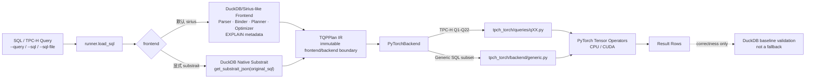
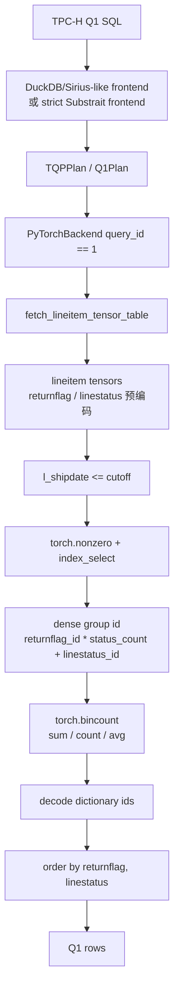

# torch-query-gpu

> 中文 README · TQP-style SQL analytics on PyTorch/CUDA tensors

`torch-query-gpu` 是一个**正确性优先**的 TQP 风格原型：从原始 SQL 出发，复用 DuckDB/Sirius-like 前端完成 SQL 解析与计划准入，再把计划交给 PyTorch 后端，在 CPU 或 CUDA tensor 上执行分析型查询。

```text
目标链路：SQL → DuckDB/Sirius-like Frontend → TQP IR → PyTorch/CUDA Operators → Result Rows
```

## 当前状态

- ✅ 默认链路支持 TPC-H Q1-Q22：原始 SQL → DuckDB planner admission → `TQPPlan` → PyTorch backend。
- ✅ CLI 能直接读取 `--query`、`--sql` 或 `--sql-file`，不需要手工导出 JSON。
- ✅ strict Substrait 路径仍可显式使用：`--frontend substrait`，只运行 DuckDB 原生 exporter 能导出的 SQL。
- ✅ Generic SQL subset 已支持单表 projection/filter/aggregate/order/limit。
- ✅ Q1 有专门 tensor fast path：预编码低基数字符串列，使用 dense group id + `torch.bincount` 做聚合。
- ✅ Q6 有 correctness-first 压缩 mask 原型：`--compressed-masks`。
- ✅ 提供冷/热端到端 benchmark：`tpch-torch-benchmark`。
- ⚠️ 当前不是完整 SQL 数据库：frontend 能接收 DuckDB 可 parse/plan 的 SQL，但 PyTorch backend 只执行已实现的 TPC-H 模板和 generic subset；其他形状会显式报 `UnsupportedPlanError`。

## 一图看懂架构



### 分层职责

| 层 | 模块 | 做什么 |
| --- | --- | --- |
| CLI | `scripts/run_query.py`, `scripts/validate_query.py`, `scripts/benchmark_query.py` | 接收 SQL 来源、frontend、device、benchmark 参数。 |
| Runner | `tpch_torch/runner.py` | 读取 SQL，编译 `TQPPlan`，调用后端，validation 时比较 DuckDB baseline。 |
| Frontend | `tpch_torch/frontend/sirius.py`, `tpch_torch/frontend/substrait.py` | 把原始 SQL 编译成 `TQPPlan`；默认是 Sirius-like DuckDB planner admission。 |
| IR | `tpch_torch/ir/plan.py` | 前端与后端之间的不可变边界对象。 |
| Backend | `tpch_torch/backend/pytorch.py`, `tpch_torch/backend/generic.py` | 分发 TPC-H 模板或 generic SQL subset，执行 PyTorch tensor 算子。 |
| Tensor/Kernels | `tpch_torch/duckdb_bridge.py`, `tpch_torch/queries/q01.py` ... `q22.py` | columnar fetch、编码、TPC-H tensor executor。 |
| Operators | `tpch_torch/operators.py`, `tpch_torch/compressed.py` | grouped reductions、lookup、top-k、Plain/RLE/Index mask 原型。 |

## Q1 是怎么实现的

Q1 当前是显式 fast path，目标是把主聚合路径放在 PyTorch tensor ops 上，而不是 Python row loop。



关键代码位置：

- `tpch_torch/backend/pytorch.py`：`query_id == 1` 时调用 `_compile_q1_plan()` 与 `execute_q1()`。
- `tpch_torch/duckdb_bridge.py`：`fetch_lineitem_tensor_table()` 用 DuckDB columnar fetch，并把 `l_returnflag` / `l_linestatus` 预编码为 int tensor。
- `tpch_torch/queries/q01.py`：过滤 `l_shipdate`，构造 dense group id，使用 `torch.bincount` 进行 grouped reductions，最后 decode 和排序。

```python
# tpch_torch/backend/pytorch.py
if plan.query_id == 1:
    q1_plan = _compile_q1_plan(plan.plan_json)
    from tpch_torch.duckdb_bridge import fetch_lineitem_tensor_table
    return execute_q1(fetch_lineitem_tensor_table(con, device=device), q1_plan)
```

```python
# tpch_torch/queries/q01.py
group_ids = (columns["l_returnflag"].to(dtype=torch.int64) * status_count) + columns[
    "l_linestatus"
].to(dtype=torch.int64)

count_order = torch.bincount(group_ids, minlength=group_count)
sum_qty = torch.bincount(group_ids, weights=quantity, minlength=group_count)
```

## 安装

```bash
python3 -m venv .venv
. .venv/bin/activate
python -m pip install -U pip
python -m pip install -e '.[dev]'
```

## 生成 TPC-H 数据

```bash
# 默认 SF=1
python -m scripts.gen_sf1 --db data/tpch_sf1.duckdb --sf 1

# 或安装 editable 后使用 entrypoint
tpch-torch-gen-sf1 --db data/tpch_sf1.duckdb --sf 1
```

## 运行与验证

### 运行单个 TPC-H 查询

```bash
tpch-torch-run \
  --db data/tpch_sf1.duckdb \
  --query 1 \
  --device cuda \
  --frontend sirius
```

没有 CUDA 的机器请使用 `--device cpu`。如果显式请求 `--device cuda` 但 PyTorch 检测不到 CUDA，命令会直接报错，不会静默回退到 CPU。

### 验证单个查询

```bash
tpch-torch-validate \
  --db data/tpch_sf1.duckdb \
  --query 1 \
  --device cuda \
  --frontend sirius
```

Validation 会运行同一条 PyTorch 链路，并把结果与 DuckDB 对同一条原始 SQL 的执行结果比较。DuckDB 只用于 baseline，不是 fallback 输出。

### 直接运行 SQL 文本或 SQL 文件

```bash
tpch-torch-validate \
  --db data/tpch_sf1.duckdb \
  --sql "select count(*) as n from lineitem" \
  --device cuda

cat queries/my_query.sql | sed -n '1,120p'
tpch-torch-run \
  --db data/tpch_sf1.duckdb \
  --sql-file queries/my_query.sql \
  --device cuda
```

当前 generic SQL subset：

```text
single-table SELECT
WHERE comparisons / IN / LIKE / AND / OR / NOT
column projection 与简单 arithmetic projection
COUNT(*), COUNT(col), SUM, MIN, MAX, AVG
simple GROUP BY
ORDER BY output columns ASC / DESC
LIMIT
```

### 验证全部 TPC-H

```bash
tpch-torch-validate \
  --db data/tpch_sf1.duckdb \
  --queries all \
  --device cuda \
  --frontend sirius \
  --keep-going
```

这条命令走完整默认链路：**SQL → DuckDB/Sirius-like frontend → TQPPlan → PyTorch backend**。

### Strict Substrait 路径

```bash
tpch-torch-run \
  --db data/tpch_sf1.duckdb \
  --query 6 \
  --device cuda \
  --frontend substrait \
  --json

# 探测 DuckDB 原生 Substrait exporter 当前覆盖情况
tpch-torch-probe-substrait --db data/tpch_sf1.duckdb --queries all --json
```

Substrait 策略：

```text
original SQL
  -> DuckDB get_substrait_json(original_sql)
  -> TQPPlan carrying real Substrait JSON
  -> PyTorch backend
```

如果 DuckDB exporter 导不出原始 SQL，该路径会显式失败；项目不会改写 SQL、伪造 JSON 或自动切到 Sirius-like 路径。

### Q6 压缩 mask 原型

```bash
tpch-torch-run \
  --db data/tpch_sf1.duckdb \
  --query 6 \
  --device cuda \
  --compressed-masks

tpch-torch-validate \
  --db data/tpch_sf1.duckdb \
  --query 6 \
  --device cuda \
  --compressed-masks
```

`--compressed-masks` 当前只改变 Q6 的 PyTorch predicate mask 执行方式：Plain/RLE/Index mask dispatch。它还不是完整压缩列存储或压缩 join/aggregate 执行。

## 冷/热性能计时

```bash
tpch-torch-benchmark \
  --db data/tpch_sf1.duckdb \
  --query 1 \
  --device cuda \
  --frontend sirius \
  --cold-runs 3 \
  --warmup-runs 5 \
  --hot-runs 20

# JSON 输出，便于脚本收集
tpch-torch-benchmark \
  --db data/tpch_sf1.duckdb \
  --query 6 \
  --device cuda \
  --compressed-masks \
  --json
```

计时语义：

- **cold**：每个样本新建 DuckDB connection，运行完整 frontend + tensor fetch/encoding + PyTorch backend + result materialization，再关闭连接。不刷新 OS page cache，也不重启 Python。
- **hot**：复用一个 DuckDB connection，先执行 `--warmup-runs`，再记录 `--hot-runs`。
- **CUDA**：每个样本前后调用 `torch.cuda.synchronize()`，报告 wall-clock ms，因此包含 CPU 侧 frontend/fetch/materialization 与 GPU work。
- Benchmark 不做 DuckDB validation；正确性请单独运行 `tpch-torch-validate`。

## TPC-H 支持矩阵

| Query set | 默认 Sirius-like frontend | Strict DuckDB Substrait frontend | PyTorch backend |
| --- | --- | --- | --- |
| Q1, Q3, Q5, Q6, Q7, Q8, Q9, Q10, Q11, Q12, Q13, Q14, Q15, Q18, Q19 | yes | yes | yes |
| Q2, Q4, Q16, Q17, Q20, Q21, Q22 | yes | DuckDB 1.2.x exporter blocked | yes |

说明：strict Substrait 的 blocked 是 DuckDB 原生 exporter 覆盖限制，不代表 PyTorch backend 没有这些查询的 executor。默认 Sirius-like 路径下 Q1-Q22 可走 PyTorch backend。

## Roadmap 摘要

完整清单见：

- 中文执行版：[`docs/operator-roadmap.zh.md`](docs/operator-roadmap.zh.md)
- 英文原版：[`docs/operator-roadmap.md`](docs/operator-roadmap.md)

当前批次状态：

- [x] TPC-H Q1-Q22 通过默认 DuckDB/Sirius-like frontend 到 PyTorch backend。
- [x] Strict DuckDB Substrait path：覆盖 DuckDB exporter 能导出的查询。
- [x] Batch 1 primitives：grouped min/max/mean、mask helpers、top-k、首批 RLE mask primitives。
- [x] Batch 2 部分 generic SQL：`MIN`、`MAX`、`AVG`、`COUNT(col)`、boolean filters、`IN`、`LIKE`、`ORDER BY ASC/DESC`。
- [x] Q1/Q6 等路径加入 columnar fetch、低基数字典编码、dense grouped reductions、compressed mask 原型。
- [ ] Generic joins、subquery lowering、`HAVING`、`CASE`。
- [ ] 完整 compressed storage metadata、encoded column execution、compressed aggregation/join。
- [ ] 显式 operator graph、fusion、scheduling、compiler lowering。

## 文档导航

| 文档 | 内容 |
| --- | --- |
| [`docs/architecture.zh.md`](docs/architecture.zh.md) | 中文架构说明、关键代码片段、Q1 分层图。 |
| [`docs/architecture.md`](docs/architecture.md) | 英文架构说明。 |
| [`docs/operator-roadmap.zh.md`](docs/operator-roadmap.zh.md) | 中文 Roadmap / TODO。 |
| [`docs/operator-roadmap.md`](docs/operator-roadmap.md) | 英文完整 Roadmap。 |
| [`docs/papers/README.md`](docs/papers/README.md) | 已下载论文与来源说明。 |

## 开发验证

```bash
# 单元测试，后端测试建议保持 60 秒 timeout
timeout 60 python -m pytest -q

# Python 文件语法检查
timeout 60 python -m compileall -q tpch_torch scripts
```
