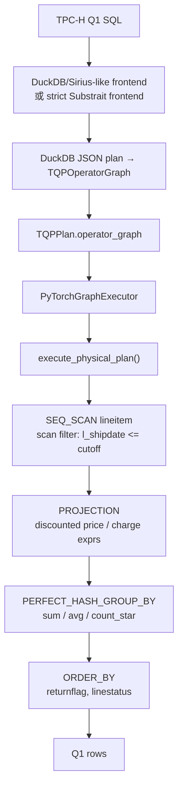

# torch-query-gpu

> 中文 README · TQP-style SQL analytics on PyTorch/CUDA tensors

`torch-query-gpu` 是一个**正确性优先**的 TQP 风格原型：从原始 SQL 出发，复用 DuckDB/Sirius-like 前端完成 SQL 解析与计划准入，再把计划交给 PyTorch 后端，在 CPU 或 CUDA tensor 上执行分析型查询。

```text
目标链路：SQL → DuckDB/Sirius-like Frontend → TQP IR → PyTorch/CUDA Operators → Result Rows
```

## 当前状态

- ✅ 默认链路支持 TPC-H Q1-Q22：原始 SQL → DuckDB `EXPLAIN (FORMAT JSON)` lowering → `TQPOperatorGraph` → PyTorch graph executor。
- ✅ CLI 能直接读取 `--query`、`--sql` 或 `--sql-file`，不需要手工导出 JSON。
- ✅ strict Substrait 路径仍可显式使用：`--frontend substrait`，只运行 DuckDB 原生 exporter 能导出的 SQL。
- ✅ Generic SQL subset 已支持单表 projection/filter/aggregate/order/limit。
- ✅ Q1/Q6 默认路径已迁入 DuckDB physical-plan interpreter：SQL → DuckDB JSON physical plan → `TQPOperatorGraph` → `execute_physical_plan()` → PyTorch tensor operators。
- ✅ Q2-Q22 已从旧 `queries/qXX` 模板调用迁到 `backend/tpch_graph_qXX` graph recipes，并组合通用 `graph_nodes`：Scan、LookupJoin、SemiJoin、AntiJoin、ScalarSubquery、GroupedScalarSubquery、MaterializedCTE、Aggregate。
- ✅ DuckDB physical-plan interpreter v1 已接入：Generic equi-join / join+group aggregate / final aggregate expression 可从 SQL 直接 lowering 到 PyTorch；TPC-H Q1/Q6/Q12/Q14/Q19 已迁到该通用 interpreter，不再走 query-id recipe。
- ✅ Q6 有 correctness-first 压缩 mask 原型：`--compressed-masks`。
- ✅ 提供冷/热端到端 benchmark：`tpch-torch-benchmark`。
- ⚠️ 当前不是完整 SQL 数据库：frontend 能接收 DuckDB 可 parse/plan 的 SQL；PyTorch 后端已能解释一批 DuckDB physical plan nodes，但复杂 subquery/CTE/window/set operation/HAVING 仍显式失败。

## 一图看懂架构

```mermaid
flowchart LR
    SQL["SQL / TPC-H Query<br/>--query / --sql / --sql-file"] --> Runner["runner.load_sql"]
    Runner --> Frontend{"frontend"}
    Frontend -->|默认 sirius| Sirius["DuckDB/Sirius-like Frontend<br/>Parser · Binder · Planner · Optimizer<br/>EXPLAIN metadata"]
    Frontend -->|显式 substrait| Substrait["DuckDB Native Substrait<br/>get_substrait_json(original_sql)"]
    Sirius --> Graph["DuckDB JSON physical plan<br/>→ TQPOperatorGraph"]
    Substrait --> IR["TQPPlan IR"]
    Graph --> IR["TQPPlan IR<br/>operator_graph boundary"]
    IR --> Backend["PyTorchBackend"]
    Backend --> GraphExec["PyTorchGraphExecutor.forward-like execute"]
    GraphExec -->|Q1/Q6/Q12/Q14/Q19 + generic joins| Physical["DuckDB physical-plan interpreter<br/>backend/physical*.py"]
    GraphExec -->|Q6 --compressed-masks| Primitives["Q6 compressed mask experimental primitive"]
    GraphExec -->|remaining Q2-Q22| Recipes["TPC-H graph recipes<br/>backend/tpch_graph_qXX.py"]
    GraphExec -->|single-table generic subset| Generic["tpch_torch/backend/generic.py"]
    Physical --> Nodes["Physical tensor nodes<br/>Scan · Filter · Project · Join · Aggregate · Sort/TopN"]
    Recipes --> Nodes2["Common graph_nodes<br/>LookupJoin · Semi/AntiJoin · ScalarSubquery · CTE · Aggregate"]
    Primitives --> Torch["PyTorch Tensor Operators<br/>CPU / CUDA"]
    Nodes --> Torch
    Nodes2 --> Torch
    Generic --> Torch
    Torch --> Rows["Result Rows"]
    Rows -. correctness only .-> DuckDB["DuckDB baseline validation<br/>not a fallback"]
```



### 分层职责

| 层 | 模块 | 做什么 |
| --- | --- | --- |
| CLI | `scripts/run_query.py`, `scripts/validate_query.py`, `scripts/benchmark_query.py` | 接收 SQL 来源、frontend、device、benchmark 参数。 |
| Runner | `tpch_torch/runner.py` | 读取 SQL，编译 `TQPPlan`，调用后端，validation 时比较 DuckDB baseline。 |
| Frontend | `tpch_torch/frontend/sirius.py`, `tpch_torch/frontend/substrait.py` | 把原始 SQL 编译成 `TQPPlan`；默认是 Sirius-like DuckDB planner admission。 |
| IR | `tpch_torch/ir/plan.py` | 前端与后端之间的不可变边界对象。 |
| Backend | `tpch_torch/backend/pytorch.py`, `tpch_torch/backend/graph.py`, `tpch_torch/backend/generic.py`, `tpch_torch/backend/physical*.py` | 只通过 `TQPOperatorGraph` 进入 PyTorch graph executor；Q1/Q6/Q12/Q14/Q19 与 generic joins 可由 DuckDB physical-plan interpreter 执行；不执行 compiled TPC-H fallback root。 |
| TPC-H graph recipes | `tpch_torch/backend/tpch_graph_q02.py` ... `q22.py` | 尚未迁入 physical interpreter 的 TPC-H 显式 graph recipe；不调用旧 `tpch_torch.queries.qXX`，只组合通用 graph nodes 与 tensor ops。 |
| Graph nodes / Operators | `tpch_torch/backend/graph_nodes.py`, `tpch_torch/backend/physical*.py`, `tpch_torch/operators.py`, `tpch_torch/compressed.py` | Scan、filter、project、lookup/hash/equi join、semi/anti join、scalar/grouped scalar subquery、CTE、aggregate、sort/top-k、Plain/RLE/Index mask 原型。 |

## Q1 是怎么实现的

Q1 当前已经从 query-id direct primitive 迁到通用 DuckDB physical-plan interpreter：DuckDB JSON physical plan 被 lowering 成 `TQPOperatorGraph`，backend 在 `PyTorchGraphExecutor` 中调用 `execute_physical_plan()`，再由 `physical.py` 解释 `SEQ_SCAN` / `PROJECTION` / `PERFECT_HASH_GROUP_BY` / `ORDER_BY` 等节点并落到 PyTorch tensor operators。



关键代码位置：

- `tpch_torch/duckdb_plan_json.py`：DuckDB `EXPLAIN (FORMAT JSON)` lowering 到 `TQPOperatorGraph`。
- `tpch_torch/backend/graph.py`：`PyTorchGraphExecutor` 将 Q1/Q6/Q12/Q14/Q19 分发到 `execute_physical_plan()`。
- `tpch_torch/backend/physical.py`：解释 DuckDB physical nodes，scan/filter/project/group/order 都由 PyTorch tensor 算子完成。
- `tpch_torch/backend/physical_expr.py`：解释 Q1 中的 arithmetic / internal compress-decompress / projection ref 表达式。

```python
# tpch_torch/backend/pytorch.py
if plan.operator_graph is not None:
    return PyTorchGraphExecutor().execute(
        con, plan, device=device, use_compressed_masks=use_compressed_masks
    )
```

```python
# tpch_torch/backend/graph.py
if plan.query_id in {1, 12, 14, 19}:
    return execute_physical_plan(con, graph, device=device)
```

## 安装

```bash
python3 -m venv .venv
. .venv/bin/activate
python -m pip install -U pip
python -m pip install -e '.[dev]'
```

## 生成 TPC-H 数据

```bash
# 默认 SF=1
python -m scripts.gen_sf1 --db data/tpch_sf1.duckdb --sf 1

# 或安装 editable 后使用 entrypoint
tpch-torch-gen-sf1 --db data/tpch_sf1.duckdb --sf 1
```

## 运行与验证

### 运行单个 TPC-H 查询

```bash
tpch-torch-run \
  --db data/tpch_sf1.duckdb \
  --query 1 \
  --device cuda \
  --frontend sirius
```

没有 CUDA 的机器请使用 `--device cpu`。如果显式请求 `--device cuda` 但 PyTorch 检测不到 CUDA，命令会直接报错，不会静默回退到 CPU。

### 验证单个查询

```bash
tpch-torch-validate \
  --db data/tpch_sf1.duckdb \
  --query 1 \
  --device cuda \
  --frontend sirius
```

Validation 会运行同一条 PyTorch 链路，并把结果与 DuckDB 对同一条原始 SQL 的执行结果比较。DuckDB 只用于 baseline，不是 fallback 输出。

### 直接运行 SQL 文本或 SQL 文件

```bash
tpch-torch-validate \
  --db data/tpch_sf1.duckdb \
  --sql "select count(*) as n from lineitem" \
  --device cuda

cat queries/my_query.sql | sed -n '1,120p'
tpch-torch-run \
  --db data/tpch_sf1.duckdb \
  --sql-file queries/my_query.sql \
  --device cuda
```

当前 generic SQL 支持分两层：

1. `backend/generic.py`：单表 SQL parser/executor。
2. `backend/physical.py`：DuckDB JSON physical-plan interpreter v1，直接解释 DuckDB plan nodes。

已支持：

```text
single-table SELECT
WHERE comparisons / IN / LIKE / AND / OR / NOT
column projection 与简单 arithmetic projection
COUNT(*), COUNT(col), SUM, MIN, MAX, AVG
simple GROUP BY
ORDER BY output columns ASC / DESC
LIMIT
DuckDB physical SEQ_SCAN / FILTER / PROJECTION
DuckDB physical HASH_JOIN inner equi-join（correctness-first）
DuckDB physical HASH_GROUP_BY / PERFECT_HASH_GROUP_BY / UNGROUPED_AGGREGATE
DuckDB physical ORDER_BY / TOP_N / LIMIT
final aggregate expression alias，例如 100 * sum(x) / sum(y)
```

本轮算子优化已覆盖 physical-plan interpreter 的几条热路径：

- `HASH_JOIN` row-index 生成从 Python `dict/list/tolist()` 改为 tensor `searchsorted` 路径；右侧 build key 已排序且唯一时跳过 `argsort` 和重复展开。
- 已知 TPC-H 低基数字符串列使用 table-aware static dictionary encoding，避免大列上反复 `numpy.unique`。
- `IN` / 同列 literal `OR` 使用 membership mask；singleton membership 直接走 equality。
- `PhysicalTable.filter/gather` 对共享 alias 的 `PhysicalValue` 只转换一次，减少 physical plan 中 `col` / `table.col` alias 的重复 tensor selection。

### 验证全部 TPC-H

```bash
tpch-torch-validate \
  --db data/tpch_sf1.duckdb \
  --queries all \
  --device cuda \
  --frontend sirius \
  --keep-going
```

这条命令走完整默认链路：**SQL → DuckDB/Sirius-like frontend → TQPPlan → PyTorch backend**。

### Strict Substrait 路径

```bash
tpch-torch-run \
  --db data/tpch_sf1.duckdb \
  --query 6 \
  --device cuda \
  --frontend substrait \
  --json

# 探测 DuckDB 原生 Substrait exporter 当前覆盖情况
tpch-torch-probe-substrait --db data/tpch_sf1.duckdb --queries all --json
```

Substrait 策略：

```text
original SQL
  -> DuckDB get_substrait_json(original_sql)
  -> TQPPlan carrying real Substrait JSON
  -> PyTorch backend
```

如果 DuckDB exporter 导不出原始 SQL，该路径会显式失败；项目不会改写 SQL、伪造 JSON 或自动切到 Sirius-like 路径。

### Q6 压缩 mask 原型

```bash
tpch-torch-run \
  --db data/tpch_sf1.duckdb \
  --query 6 \
  --device cuda \
  --compressed-masks

tpch-torch-validate \
  --db data/tpch_sf1.duckdb \
  --query 6 \
  --device cuda \
  --compressed-masks
```

`--compressed-masks` 当前只改变 Q6 的 PyTorch predicate mask 执行方式：Plain/RLE/Index mask dispatch。它还不是完整压缩列存储或压缩 join/aggregate 执行。

## 冷/热性能计时

```bash
tpch-torch-benchmark \
  --db data/tpch_sf1.duckdb \
  --query 1 \
  --device cuda \
  --frontend sirius \
  --cold-runs 3 \
  --warmup-runs 5 \
  --hot-runs 20

# JSON 输出，便于脚本收集
tpch-torch-benchmark \
  --db data/tpch_sf1.duckdb \
  --query 6 \
  --device cuda \
  --compressed-masks \
  --json
```

计时语义：

- **cold**：每个样本新建 DuckDB connection，运行完整 frontend + tensor fetch/encoding + PyTorch backend + result materialization，再关闭连接。不刷新 OS page cache，也不重启 Python。
- **hot**：复用一个 DuckDB connection，先执行 `--warmup-runs`，再记录 `--hot-runs`。
- **CUDA**：每个样本前后调用 `torch.cuda.synchronize()`，报告 wall-clock ms，因此包含 CPU 侧 frontend/fetch/materialization 与 GPU work。
- Benchmark 不做 DuckDB validation；正确性请单独运行 `tpch-torch-validate`。

### 最近一次 Q1 性能对比（SF=1）

同一台机器（CPU + RTX 4090），命令均为 `--cold-runs 3 --warmup-runs 3 --hot-runs 10 --frontend sirius`。计时为端到端 wall-clock，包含 DuckDB frontend、tensor fetch/encoding、PyTorch 执行和结果 materialization；未刷新 OS page cache。

| 版本 | device | cold median | hot median | 变化（hot median） |
| --- | --- | ---: | ---: | ---: |
| `c8b3bd9`（full graph recipes merge 前） | CPU | 794.123 ms | 794.571 ms | baseline |
| 当前 physical-interpreter 分支 | CPU | 973.831 ms | 904.851 ms | +13.9% |
| `c8b3bd9`（full graph recipes merge 前） | CUDA | 675.461 ms | 650.313 ms | baseline |
| 当前 physical-interpreter 分支 | CUDA | 745.996 ms | 703.522 ms | +8.2% |

注意：该历史表是在 Q1 迁入 physical interpreter 之前记录的 direct primitive 路径数据。Q1 现在已经改为 SQL-lowered physical interpreter 路径，后续需要重新建立新的冷/热性能基线。

### 当前算子优化 smoke benchmark（SF=1）

命令均为 `--cold-runs 1 --warmup-runs 1 --hot-runs 3 --frontend sirius --device cpu`，计时端到端且较短，仅用于确认优化方向：

| Query | 优化前 hot median | 优化后 hot median | 说明 |
| --- | ---: | ---: | --- |
| Q12 | 2293.140 ms | 2049.648 ms | static dictionary + alias 去重；join 仍受 row expansion 影响 |
| Q14 | 857.160 ms | 703.668 ms | sorted unique build-side join fast path |
| Q19 | 2111.015 ms | 1744.495 ms | tensor join + membership/OR 折叠 + alias 去重 |

Q1 已在后续改为 DuckDB physical-plan interpreter 路径；上表 smoke benchmark 主要覆盖 Q12/Q14/Q19 和 generic physical-plan 算子优化。

## TPC-H 支持矩阵

| Query set | 默认 Sirius-like frontend | Strict DuckDB Substrait frontend | PyTorch backend | 当前后端形态 |
| --- | --- | --- | --- | --- |
| Q1, Q6, Q12, Q14, Q19 | yes | yes | yes | DuckDB physical-plan interpreter v1 by default |
| Q6 `--compressed-masks` | yes | yes | yes | explicit compressed-mask primitive experiment |
| Q3, Q5, Q7, Q8, Q9, Q10, Q11, Q13, Q15, Q18 | yes | yes | yes | TPC-H graph recipes |
| Q2, Q4, Q16, Q17, Q20, Q21, Q22 | yes | DuckDB 1.2.x exporter blocked | yes | TPC-H graph recipes |

说明：strict Substrait 的 blocked 是 DuckDB 原生 exporter 覆盖限制，不代表 PyTorch backend 没有这些查询的 executor。默认 Sirius-like 路径下 Q1-Q22 都先 lowering 到 `TQPOperatorGraph` 再进入 PyTorch backend。

## Roadmap 摘要

完整清单见：

- 中文执行版：[`docs/operator-roadmap.zh.md`](docs/operator-roadmap.zh.md)
- 英文原版：[`docs/operator-roadmap.md`](docs/operator-roadmap.md)

当前批次状态：

- [x] TPC-H Q1-Q22 通过 DuckDB JSON physical plan lowering 到 `TQPOperatorGraph` 后进入 PyTorch graph executor。
- [x] Strict DuckDB Substrait path：覆盖 DuckDB exporter 能导出的查询。
- [x] Batch 1 primitives：grouped min/max/mean、mask helpers、top-k、首批 RLE mask primitives。
- [x] Batch 2 部分 generic SQL：`MIN`、`MAX`、`AVG`、`COUNT(col)`、boolean filters、`IN`、`LIKE`、`ORDER BY ASC/DESC`。
- [x] Q1 已迁到 DuckDB physical-plan interpreter：由 SQL-lowered physical graph 自动调用 PyTorch tensor operators。
- [x] Q6 默认路径已迁到 DuckDB physical-plan interpreter；`--compressed-masks` 保留显式 compressed mask primitive 实验。
- [x] Generic equi-join / join+aggregate / final aggregate expression 已通过 DuckDB physical-plan interpreter v1 跑通。
- [x] Physical-plan 算子热路径优化：tensor join index、sorted-unique build fast path、static dictionary encoding、membership mask、alias 去重 gather/filter。
- [ ] Generic subquery lowering、`HAVING`、window、set operations。
- [ ] 完整 compressed storage metadata、encoded column execution、compressed aggregation/join。
- [x] 第一版显式 `TQPOperatorGraph` 与 DuckDB JSON lowering。
- [x] Q2-Q22 graph recipes 已组合通用 Join/Subquery/CTE/Aggregate graph nodes，不再调用旧查询模板。
- [x] Q1/Q6/Q12/Q14/Q19 默认路径已从 query-id recipe/direct primitive 迁到 DuckDB physical-plan interpreter。
- [ ] 继续将剩余 Q2-Q22 recipes 迁到 DuckDB physical-plan interpreter，覆盖 subquery/CTE/delim/mark/nested-loop 等节点。
- [ ] fusion、scheduling、compiler lowering。

## 文档导航

| 文档 | 内容 |
| --- | --- |
| [`docs/architecture.zh.md`](docs/architecture.zh.md) | 中文架构说明、关键代码片段、Q1 分层图。 |
| [`docs/architecture.md`](docs/architecture.md) | 英文架构说明。 |
| [`docs/operator-roadmap.zh.md`](docs/operator-roadmap.zh.md) | 中文 Roadmap / TODO。 |
| [`docs/operator-roadmap.md`](docs/operator-roadmap.md) | 英文完整 Roadmap。 |
| [`docs/papers/README.md`](docs/papers/README.md) | 已下载论文与来源说明。 |

## 开发验证

```bash
# 单元测试，后端测试建议保持 60 秒 timeout
timeout 60 python -m pytest -q

# Python 文件语法检查
timeout 60 python -m compileall -q tpch_torch scripts
```
