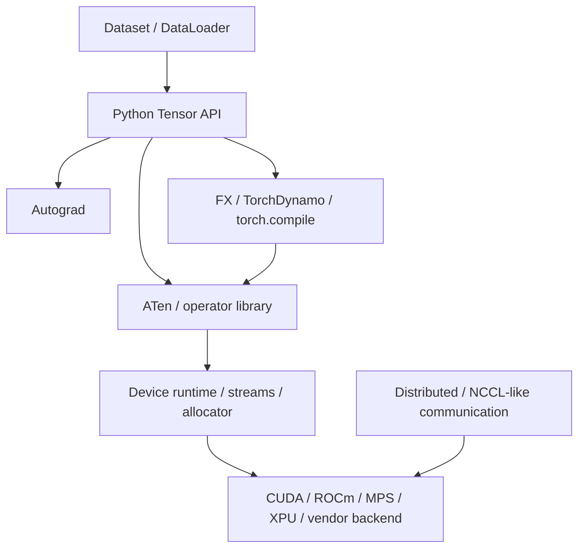
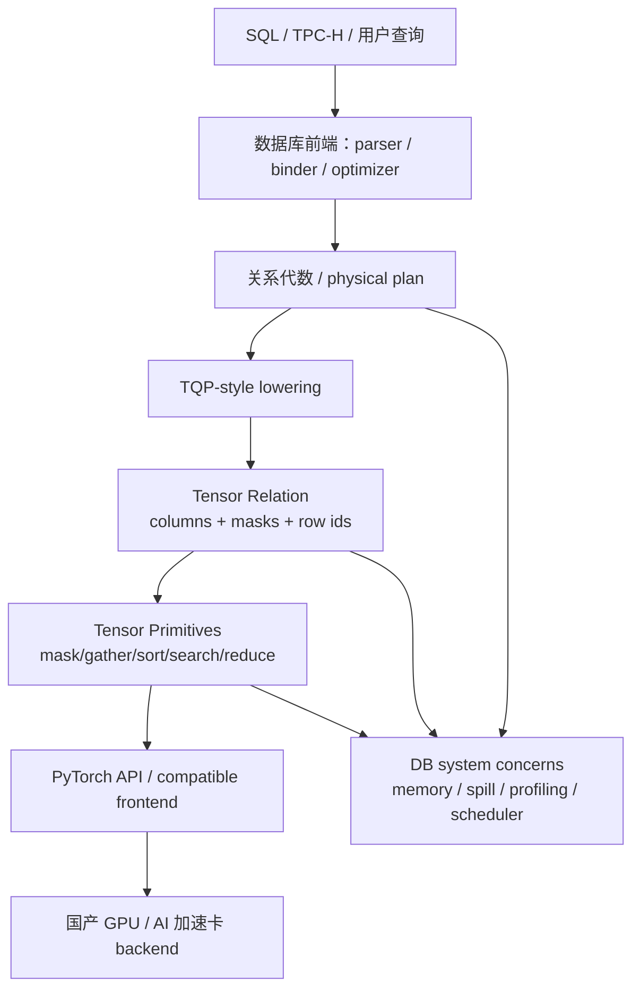

# 基于国产 GPU 与 AI Tensor 生态构建数据库执行引擎：从当前 Demo 到 TQP / CoddSpeed

本文面向一次技术分享，目标是建立一个完整视图：如果底层硬件不是 NVIDIA CUDA，而是国产 AI 加速卡 / 国产 GPU，是否可以复用 AI tensor 生态来做数据库执行引擎？当前 `torch-query-gpu` demo 说明了一条可行的研究路径：复用 DuckDB 做 SQL 前端，把关系代数 lowering 成 tensor operator graph，再用 PyTorch 或兼容 PyTorch 的国产 AI runtime 执行。

本文会同时覆盖整体架构和关键细节：PyTorch 到底提供了什么能力，本 demo 实际用了哪些能力，数据流图和 runtime 是否有用，怎样用 tensor 表达关系代数，以及 TQP / CoddSpeed 给了哪些参考。

> 说明：仓库已经下载 TQP 与 compressed-data GPU SQL 论文 PDF；CoddSpeed 当前只有公开 Microsoft Research 页面和仓库记录，全文 PDF 在本环境不可达。因此本文对 CoddSpeed 的描述仅基于公开摘要与 [`docs/papers/README.md`](papers/README.md)，不伪造未读取的全文细节。

## 1. 一句话结论

在国产卡基础上用 AI tensor 生态做 DB，是一条有吸引力但边界很清楚的路线：

```text
SQL / relational algebra
  → tensor program / tensor graph
  → PyTorch API 或 PyTorch-compatible frontend
  → 国产卡 runtime / compiler / kernel library
```

它的核心价值不是“PyTorch 天然就是数据库”，而是：AI 生态已经为国产卡投入了大量工程能力，包括 tensor API、设备抽象、算子库、allocator、profiling、图编译、分布式通信、模型训练中积累的数据搬运和异步执行机制。数据库系统可以把关系算子编译成 tensor primitives，从而复用这些能力。

但是当前 demo 还主要复用 **PyTorch eager tensor 算子库 + CUDA/CPU device 抽象 + allocator**。它还没有充分利用 PyTorch 的 DataLoader、多线程 prefetch、TorchScript/FX/`torch.compile` 图编译、分布式 runtime，也没有实现成熟 DB engine 需要的 query-level memory planner、cost model 和完整 SQL 语义。

## 2. 分享视角：为什么这件事值得讲

传统数据库执行引擎通常是围绕 tuple/column、operator pipeline、buffer manager、optimizer 和 hand-written kernels 构建。AI tensor 生态则围绕 tensor、operator graph、device runtime、kernel library 和 compiler 构建。

这两者的交集是：

- 数据库列可以看作一维 tensor；
- 关系代数可以表达成 mask、gather、scatter、sort、unique、reduce、search 等 tensor primitives；
- GPU / NPU / AI 加速卡擅长大批量、规则、SIMT/SIMD 风格的数据并行；
- PyTorch 生态已经适配很多硬件后端，国产卡通常也会优先兼容 PyTorch 或提供 PyTorch-like frontend。

因此，对国产卡来说，TQP-style 路线有一个非常现实的工程意义：与其为每张卡重新写一个完整 SQL engine，不如先把 SQL lowering 到 tensor IR，然后复用 AI runtime 的已有算子和编译器。

## 3. 当前 Demo 的端到端路径

当前仓库采用的是 DuckDB/Sirius-like 前端 + TQP-style backend：


边界要说清楚：

- DuckDB 负责 SQL 解析、绑定、类型检查、physical plan 导出，以及 validation baseline；
- DuckDB 不作为最终执行 fallback；
- `TQPOperatorGraph` 是前后端边界；
- PyTorch backend 解释 graph，把 physical nodes 变成 tensor relation 操作；
- 当前默认后端是 PyTorch CPU/CUDA，不是 RAPIDS/cuDF/RMM；
- 如果换成国产卡，理想情况是 PyTorch API 层不变，设备后端换成国产 runtime。

当前 demo 的意义是证明：TPC-H 查询不必都写成 query-id script，可以从原始 SQL 出发，经过 DuckDB physical plan lowering，进入 PyTorch/tensor execution。

## 4. PyTorch 框架提供了哪些能力

从数据库视角看，PyTorch 不只是一个深度学习框架。它至少包含以下层次：



对 DB 来说，各层价值不同：

| PyTorch 能力 | 对 DB 的可能价值 | 当前 demo 是否主要使用 |
| --- | --- | --- |
| Tensor 数据结构 | 用一维/二维 tensor 表示列、key、mask、group id、row id。 | 是，核心依赖。 |
| 算子库 | 复用 `where`、`argsort`、`searchsorted`、`unique`、`bincount`、`index_add`、`scatter_reduce`、`topk` 等。 | 是，核心依赖。 |
| Device 抽象 | 同一套 tensor API 可以跑 CPU/CUDA；国产卡可通过 PyTorch backend 接入。 | 是，基础依赖。 |
| CUDA/device allocator | 复用 PyTorch caching allocator，避免手动管理每次 GPU allocation。 | 是，但不是 SQL-aware memory manager。 |
| Streams / events / profiling | 可用于异步执行、精确计时、定位 kernel/拷贝瓶颈。 | 部分使用 timing；系统 profiler 还不充分。 |
| Autograd | 用于训练反向传播。关系查询一般不需要梯度。 | 基本不用。 |
| Dataset / DataLoader | 多进程/多线程 prefetch、batch 组装、pin memory、异步 H2D。 | 当前不作为主路径。 |
| FX / TorchDynamo / `torch.compile` | 捕获 Python tensor 程序图，做 fusion/codegen/graph optimization。 | 当前未充分使用，未来可探索。 |
| Distributed | 多卡通信、collective、分布式 runtime。 | 当前未使用。 |

### 4.1 当前 demo 主要用了 PyTorch 的哪部分

当前主要用的是 **eager tensor 算子库** 和 **device/allocator 能力**。也就是：

```text
relation operator
  → Python physical interpreter
  → torch tensor op 1
  → torch tensor op 2
  → torch tensor op 3
  → result tensor
```

典型调用包括：

- `torch.as_tensor` / `torch.tensor`：把 DuckDB/NumPy 读取出来的列变成 tensor；
- `torch.where` / 逻辑运算：实现 `CASE WHEN`、谓词组合；
- boolean mask + gather：实现 selection；
- `torch.argsort` / `torch.topk`：实现 order by / top-k；
- `torch.unique` / `torch.unique_consecutive`：发现 group keys；
- `torch.bincount` / `index_add` / `scatter_reduce`：实现 grouped aggregate；
- `torch.searchsorted`：实现 sorted join / membership probe；
- `torch.isin`：实现部分 semi join / membership；
- `.to(device)`：控制 CPU/CUDA 设备。

因此，“目前是不是只是用算子库能力？”答案是：**主要是，但不完全是**。它还用了 PyTorch 的 tensor abstraction、device placement、allocator、CPU/GPU dtype 行为、部分 timing/profiling 基础。但它还没有把 PyTorch 的 graph compiler / runtime scheduling 当成核心执行层。

### 4.2 数据流图与 PyTorch 运行时能力有没有用

有用，但要分层看：

1. **当前 TQPOperatorGraph 是数据库层的数据流图**  
   它描述的是 SQL physical operators：scan、filter、project、join、aggregate、sort、limit。这个图不是 PyTorch FX graph，也不是 TorchScript graph。
2. **PyTorch eager runtime 执行 tensor op**  
   当前每个 physical node 内部会发起多个 torch op。每个 torch op 到后端可能是一个或多个 kernel。
3. **未来可以把 tensor program 交给 PyTorch graph/compiler**  
   如果一段关系算子能稳定表达为纯 tensor function，就可以探索 `torch.compile` / FX / vendor graph compiler，把多个 eager ops fuse 成更少 kernel，减少 Python overhead 和中间 tensor materialization。

所以，本项目里有两种 graph：

| 图 | 表达什么 | 当前作用 | 未来潜力 |
| --- | --- | --- | --- |
| `TQPOperatorGraph` | SQL / relational physical operators | 前后端边界，确保不是 query-id script。 | 做 cost-based lowering、operator fusion、memory planning。 |
| PyTorch FX / compile graph | tensor program 内部的 op graph | 当前未作为主执行路径。 | 做 tensor-level fusion、codegen、国产卡 compiler 对接。 |

### 4.3 DataLoader 多线程并发取数据对 DB 有多大意义

PyTorch `Dataset` / `DataLoader` 的经典用途是训练：多 worker 从磁盘/CPU 读取样本，做 decode/augment/collate，攒成 batch，再把 batch 送到 GPU，避免 GPU 等数据。

数据库查询的数据流不同：

- DB 扫描通常是列式、连续、批量，不是大量小样本；
- 关系查询的 batch 边界由 scan chunk、pipeline、join build/probe、group-by state 决定；
- 查询可能需要全局算子，例如 sort、group-by、join，这些不总能简单按训练 batch 独立处理；
- DB 更关注 predicate pushdown、column pruning、late materialization、buffer reuse 和 spill。

因此 DataLoader 思路有借鉴价值，但不能直接当成 DB scan engine：

| DataLoader 能力 | DB 中可借鉴 | DB 需要额外解决 |
| --- | --- | --- |
| 多 worker prefetch | 文件/host scan 与 GPU compute overlap。 | SQL pipeline backpressure、operator state、事务一致性。 |
| pinned memory | 加速 host→device transfer。 | 列式 buffer pool、device residency、spill。 |
| batch/collate | 把数据组织成 GPU-friendly chunks。 | join/group/sort 的跨 chunk 状态与全局正确性。 |
| async copy | 减少 GPU 等待。 | stream scheduling、operator dependency、query memory budget。 |

当前 demo 没有把 DataLoader 作为核心，因为它先解决的是 SQL→operator→tensor 的正确性链路。未来如果做大表 scan 和冷热 benchmark，DataLoader-like prefetch 可以作为数据摄取层的实现参考，但需要 DB-specific scan scheduler。

## 5. 用 tensor 表示关系数据

在不考虑压缩和复杂存储优化时，最直接的表示是 columnar tensor relation：

```python
Relation = {
    "l_orderkey": torch.Tensor[int64],
    "l_quantity": torch.Tensor[float64],
    "l_shipdate": torch.Tensor[int32],
    "l_returnflag": torch.Tensor[int64],  # dictionary encoded string
    "valid_mask": torch.Tensor[bool] | None,
}
```

约定：

- 一列是一个一维 tensor，长度等于 row count；
- 同一 relation 中所有列长度一致；
- 字符串可以先 dictionary encode 成 int id；
- date 可以 encode 成 `YYYYMMDD` 或 days-since-epoch 的 integer；
- SQL null 需要额外 validity mask；当前 demo 对 null 语义还不完整；
- row identity 可以用 `torch.arange(n)` 表示。

这相当于把数据库的 columnar batch 直接映射成 tensor batch。

## 6. 用 tensor 实现关系代数

下面以不考虑压缩、分布式和复杂 null semantics 为前提，说明基本关系代数如何落到 tensor。

### 6.1 Selection / Filter

SQL：

```sql
select * from lineitem
where l_shipdate <= date '1998-09-02'
  and l_discount between 0.05 and 0.07;
```

Tensor 表达：

```python
mask = (shipdate <= 19980902) & (discount >= 0.05) & (discount <= 0.07)
out = {name: col[mask] for name, col in table.items()}
```

核心 primitives：比较运算、`torch.logical_and`、boolean mask gather。

### 6.2 Projection / Expression

SQL：

```sql
select l_extendedprice * (1 - l_discount) as disc_price
from lineitem;
```

Tensor 表达：

```python
disc_price = extendedprice * (1.0 - discount)
```

核心 primitives：elementwise arithmetic、`torch.where` 表达 `CASE WHEN`。

### 6.3 Group-by Aggregate

SQL：

```sql
select l_returnflag, l_linestatus, sum(l_quantity), count(*)
from lineitem
group by l_returnflag, l_linestatus;
```

一种 tensor 实现：

```python
keys = torch.stack((returnflag.to(torch.int64), linestatus.to(torch.int64)), dim=1)
unique_keys, group_ids = torch.unique(keys, dim=0, sorted=True, return_inverse=True)

sum_qty = torch.zeros(unique_keys.shape[0], dtype=quantity.dtype, device=quantity.device)
sum_qty = sum_qty.index_add(0, group_ids, quantity)

ones = torch.ones_like(group_ids, dtype=torch.int64)
count = torch.zeros(unique_keys.shape[0], dtype=torch.int64, device=quantity.device)
count = count.index_add(0, group_ids, ones)
```

如果输入已经按 group key 排好序，可以用 `torch.unique_consecutive` 减少排序/去重成本。Q1 的 fused path 进一步用 dense group id + masked `torch.bincount` 做更直接的 grouped reductions。

### 6.4 Join

最简单的 equi-join 可以用 sorted probe 表达：

```python
order = torch.argsort(build_key)
sorted_build_key = build_key[order]

starts = torch.searchsorted(sorted_build_key, probe_key, right=False)
ends = torch.searchsorted(sorted_build_key, probe_key, right=True)
match_count = ends - starts
```

如果 build key 唯一，可以直接找到匹配位置并 gather build-side columns；如果不唯一，需要展开 one-to-many matches，生成 left row ids 和 right row ids。

```python
has_match = match_count > 0
right_pos = order[starts[has_match]]
left_pos = torch.arange(probe_key.numel(), device=probe_key.device)[has_match]
joined_col = build_value[right_pos]
```

核心 primitives：`argsort`、`searchsorted`、`arange`、gather、repeat/interleave。对于 semi/anti join，只需要 membership mask，不一定 materialize join rows。

### 6.5 Sort / Order By / TopK

SQL：

```sql
select * from orders order by o_totalprice desc limit 10;
```

Tensor 表达：

```python
values, idx = torch.topk(totalprice, k=10, largest=True, sorted=True)
out = {name: col[idx] for name, col in table.items()}
```

如果没有 limit，使用 `torch.argsort`；多 key order by 需要 lexicographic ordering，通常要组合 key、稳定排序或实现专用 comparator/packing。

### 6.6 Distinct / Semi Join / IN

```python
accepted = torch.unique(build_key)
mask = torch.isin(probe_key, accepted)
```

或者用 sorted `searchsorted` 实现 membership probe，减少 `isin` 对某些后端的不确定性能。

### 6.7 Scalar Subquery / Correlated Subquery

很多 SQL subquery 可以 decorrelate 成 join + aggregate。例如：

```sql
where ps_availqty > 0.5 * (
  select sum(l_quantity)
  from lineitem
  where l_partkey = ps_partkey and l_suppkey = ps_suppkey
)
```

Tensor 方式：先按 `(l_partkey, l_suppkey)` group-by 求 sum，再用 probe keys 查回外层 relation：

```python
subq = grouped_sum(keys=(l_partkey, l_suppkey), values=l_quantity)
lookup_value = lookup_by_keys(subq.keys, subq.values, probe=(ps_partkey, ps_suppkey))
mask = ps_availqty > 0.5 * lookup_value
```

当前仓库的 `GroupedScalarSubqueryNode` 就是这种思想。

## 7. TQP 的特殊细节

TQP 的关键点不是简单地说“SQL 用 tensor 写一遍”。它有几条重要设计原则：

1. **把关系算子转成 tensor routines**  
   不是 row-by-row Python loop，而是批量 tensor 操作。这样才能让 runtime 看到大块数据并调用 GPU kernels。
2. **避免 data-dependent Python control flow**  
   如果执行路径依赖每一行数据，Python 会变成瓶颈，也难以被 tensor runtime/graph compiler 优化。应该把分支变成 mask、`where`、scatter/gather。
3. **用 tensor runtime 的算子组合表达 DB operators**  
   例如 group-by 可以转成 key encoding + reduce；join 可以转成 sort/search/gather；filter 可以转成 mask。
4. **把优化重点从 kernel 编写转成 lowering/fusion**  
   性能瓶颈常在中间 tensor materialization、kernel launch overhead、数据搬运和 primitive 组合方式，而不是单个算子是否能跑。
5. **复用 AI runtime 的工程投资**  
   包括 device backend、allocator、profiling、kernel library、compiler 和多硬件适配。

用当前 demo 来对照：

| TQP 原则 | 当前 demo 对应状态 |
| --- | --- |
| SQL → tensor program | DuckDB JSON physical plan → `TQPOperatorGraph` → PyTorch physical interpreter。 |
| 批量 tensor routines | filter、join、aggregate、sort 等均用 tensor op 批量执行。 |
| 避免 row loop | 主要路径避免逐行循环，但输出 materialization 和部分复杂语义仍有 host 侧处理。 |
| 利用 runtime | 主要利用 PyTorch eager runtime 和 CUDA kernels。 |
| fusion/compiler | Q1 有局部 fused primitive；还没有系统使用 `torch.compile` / ML compiler。 |

## 8. CoddSpeed 给出的系统启发

CoddSpeed 的公开摘要显示，它面向 Microsoft Fabric 中硬件加速查询，GPU execution engine 源自 TQP，并把数据移动、不同 accelerator 和网络作为系统级问题处理。

这给国产卡 DB 路线几个启发：

- 不要只看单机单查询 kernel 性能；数据平台集成和数据移动同样关键；
- 加速器可以不止一种，GPU/NPU/FPGA/ASIC 都需要统一抽象；
- SQL-to-tensor 只是第一步，生产系统还需要资源调度、数据放置、网络传输、容错和隔离；
- 如果国产卡生态已有 PyTorch-compatible frontend，那么 TQP-style lowering 可以成为跨硬件后端的共同入口；
- 但如果国产卡某些 torch ops 覆盖不足，DB engine 需要有 operator capability registry 和 fallback/替代算法策略。

本文不声称当前 demo 已经具备 CoddSpeed 级别能力；它只是处在“单机、单进程、PyTorch tensor backend 原型”的阶段。

## 9. 国产卡落地时要关注什么

如果把这条路线迁到国产卡，关键评估点不是“能不能 import torch”，而是：

| 评估项 | 为什么重要 |
| --- | --- |
| PyTorch API 覆盖 | DB 依赖的 `unique`、`argsort`、`searchsorted`、`bincount`、`scatter_reduce`、`topk` 是否有 device 实现。 |
| dtype 覆盖 | int64、float64、bool、date/int32、可能的 decimal 是否高效支持。 |
| 动态 shape 支持 | SQL filter/join 后 cardinality 变化频繁，输出 shape 往往数据相关。 |
| gather/scatter 性能 | DB 大量依赖随机访问、重排、join probe，不只是 dense matmul。 |
| sort / top-k 性能 | 分析查询中排序、group-by、join 都常依赖排序能力。 |
| H2D/D2H 带宽 | 数据库经常从存储/CPU 读列，再搬到 device。 |
| allocator 行为 | 中间 tensor 多，碎片化和峰值显存会影响稳定性。 |
| graph compiler 兼容性 | 能否融合 elementwise/filter/project/aggregate，减少 launch 和 materialization。 |
| profiling 工具 | 没有 kernel-level profiler 很难解释性能差异。 |
| fallback 策略 | 某些 torch op 没有高效实现时，需要替代算法或自定义 kernel。 |

国产卡上的 AI 框架往往优先优化神经网络热点，例如 matmul、conv、attention、norm。数据库热点不同：sort、hash/group、scatter/gather、dictionary/string、membership probe、variable-length output 更重要。因此，TQP-style DB 是对国产 AI runtime 的一个很好的压力测试。

## 10. 当前 demo 还需要提升什么

为了让分享既有完整视图又不脱离现实，需要明确当前 demo 的短板：

1. **从 physical interpreter 走向更显式的 operator graph**  
   TPC-H 虽然能跑，但还要继续把复杂 shape 拆成通用 graph nodes，而不是隐藏在兼容解释器里。
2. **系统化 tensor primitive lowering**  
   每个关系算子需要明确 lowering 规则、输入/输出 schema、null mask、cardinality 变化和 memory footprint。
3. **利用 PyTorch graph/compiler 能力**  
   目前主要是 eager op。下一步可选取 Q1/Q6 这样的局部纯 tensor function，试验 `torch.compile` 或国产卡 graph compiler。
4. **query-level memory management**  
   PyTorch allocator 只管 allocation，不懂 SQL DAG。DB 层需要 lifetime analysis、buffer reuse、peak memory estimate、spill 策略。
5. **更完整的 SQL 语义**  
   null、decimal、string collation、outer join、window、复杂 subquery、set operations 还需要系统设计。
6. **性能解释闭环**  
   benchmark 要拆成 compile、scan、H2D、kernel、D2H、materialize、validation；并配 profiler 解释每个热点。
7. **硬件能力注册**  
   面向国产卡时，要知道每个 torch primitive 是否真的有 device kernel、性能如何、是否需要替代实现。

## 11. 分享时可以用的主线

建议把分享组织成三层：

```text
第一层：为什么可行
  DB columnar execution 和 tensor batch execution 有天然交集；国产卡 AI 生态已经有 PyTorch-compatible runtime。

第二层：怎么做
  SQL → DuckDB plan → TQP graph → tensor relation → torch primitives → device backend。

第三层：难在哪里
  关系语义、动态 shape、join/group/sort、显存、数据移动、fusion、profiling、硬件算子覆盖。
```

一张总图可以这样画：



## 12. 参考入口

- 当前架构：[`docs/architecture.zh.md`](architecture.zh.md)
- Q1 端到端执行链路：[`docs/q1-end-to-end-execution.zh.md`](q1-end-to-end-execution.zh.md)
- GPU SQL / Tensor Query 软件栈分析：[`docs/gpu-sql-ecosystem-analysis.zh.md`](gpu-sql-ecosystem-analysis.zh.md)
- GPU 数据库引擎评估 HTML：[`docs/gpu-db-engine-assessment.zh.html`](gpu-db-engine-assessment.zh.html)
- TQP / TQEx / TQP++ / CoddSpeed paper notes：[`docs/papers/README.md`](papers/README.md)
- PyTorch 官方文档入口：<https://docs.pytorch.org/docs/stable/index.html>
- PyTorch CUDA semantics / memory management：<https://docs.pytorch.org/docs/stable/notes/cuda.html>
- PyTorch DataLoader：<https://docs.pytorch.org/docs/stable/data.html>
- PyTorch FX：<https://docs.pytorch.org/docs/stable/fx.html>
- `torch.compile`：<https://docs.pytorch.org/docs/stable/generated/torch.compile.html>
