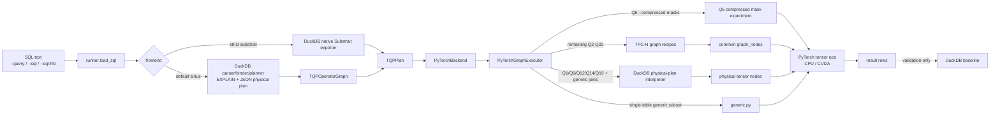
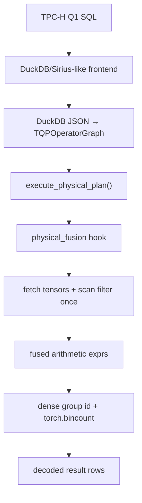

# Current Architecture: DuckDB/Sirius-like Frontend → TQP IR → PyTorch Graph Nodes

中文版本见 [`docs/architecture.zh.md`](architecture.zh.md).

This repository is a correctness-first TQP-style prototype for analytical query
execution on PyTorch tensors. The default path uses DuckDB for SQL admission and
planning metadata, lowers DuckDB JSON physical plans into `TQPOperatorGraph`,
and executes the plan through PyTorch graph nodes on CPU or CUDA. DuckDB is used
as a validation baseline only; PyTorch result rows are never sourced from DuckDB
fallback execution.

## End-to-end flow



## Current backend contract

- All TPC-H Q1-Q22 enter the backend with a real `TQPOperatorGraph` root lowered
  from DuckDB `EXPLAIN (FORMAT JSON)`.
- `OperatorKind.COMPILED_TPCH` roots are rejected; there is no compiled-template
  fallback path.
- Q1/Q6/Q12/Q14/Q19 execute through `tpch_torch/backend/physical*.py`, a correctness-first interpreter for DuckDB JSON physical plan nodes.
- Q6 defaults to the physical interpreter; `--compressed-masks` remains an explicit compressed-mask primitive experiment in `tpch_torch/backend/graph.py`.
- The remaining complex Q2-Q22 shapes execute `tpch_torch/backend/tpch_graph_qXX.py`
  graph recipes composed from reusable nodes in `tpch_torch/backend/graph_nodes.py`.
- Non-TPC-H SQL first uses the explicit single-table generic subset where it applies;
  joins and join+aggregate shapes are handled by the physical-plan interpreter.
  Unsupported generic shapes raise `UnsupportedPlanError`.

## Module map

| Layer | Files | Responsibility |
| --- | --- | --- |
| CLI | `scripts/run_query.py`, `scripts/validate_query.py`, `scripts/benchmark_query.py` | Parse query source, frontend, device, validation and benchmark options. |
| Runner | `tpch_torch/runner.py` | Thin orchestration: load SQL, compile frontend plan, call backend, optionally validate. |
| Frontend | `tpch_torch/frontend/sirius.py`, `tpch_torch/frontend/substrait.py` | Compile original SQL into `TQPPlan`. |
| DuckDB lowering | `tpch_torch/duckdb_plan_json.py`, `tpch_torch/planner.py` | Export DuckDB textual/JSON plans and lower JSON nodes to `TQPOperatorGraph`. |
| IR | `tpch_torch/ir/plan.py`, `tpch_torch/operator_graph.py` | Immutable frontend/backend boundary. |
| Backend dispatch | `tpch_torch/backend/pytorch.py`, `tpch_torch/backend/graph.py` | Require graph execution for TPC-H; route Q1/Q6/Q12/Q14/Q19 physical interpretation, Q6 compressed-mask primitive experiment, remaining recipes, and generic SQL. |
| Physical interpreter | `tpch_torch/backend/physical.py`, `physical_expr.py`, `physical_expr_folding.py`, `physical_join.py`, `physical_sql.py`, `physical_types.py`, `static_dictionaries.py` | Interpret DuckDB `SEQ_SCAN`, `FILTER`, `PROJECTION`, inner equi `HASH_JOIN`, grouped/ungrouped aggregate, `ORDER_BY`, `TOP_N`, `LIMIT`, final aggregate expressions; includes tensor join-index generation, membership folding, static dictionary encoding, and alias-deduplicated selection. |
| Graph nodes | `tpch_torch/backend/graph_nodes.py` | Scan, filter, lookup join, semi/anti join, scalar subquery, grouped scalar subquery, CTE materialization, aggregate, sort/limit helpers. |
| TPC-H recipes | `tpch_torch/backend/tpch_graph_q02.py` ... `q22.py` | Query-specific graph recipes for shapes not yet moved to the physical interpreter; do not call old `tpch_torch.queries.qXX` templates. |
| Tensor operators | `tpch_torch/operators.py`, `tpch_torch/compressed.py` | Grouped reductions, low-cardinality group ids, top-k, Plain/RLE/Index mask primitives. |

## Key code snippets

Frontend lowering attaches an operator graph to the plan:

```python
physical_plan_json = export_duckdb_physical_plan_json(con, sql)
operator_graph = lower_duckdb_json_to_operator_graph(sql, query_id, physical_plan_json)
return TQPPlan(..., operator_graph=operator_graph)
```

Backend execution refuses non-graph TPC-H plans and compiled compatibility roots:

```python
if plan.operator_graph is not None:
    return PyTorchGraphExecutor().execute(con, plan, device=device)
if plan.query_id is not None:
    raise UnsupportedPlanError(
        f"TPC-H Q{plan.query_id} requires a frontend-lowered TQP operator graph"
    )
```

DuckDB physical-plan interpretation is now a separate backend layer:

```python
# tpch_torch/backend/graph.py
if plan.query_id in {1, 6, 12, 14, 19}:
    return execute_physical_plan(con, graph, device=device)
```

```python
# tpch_torch/backend/physical.py
if node.kind == OperatorKind.JOIN:
    return self._execute_join(node)
if node.kind == OperatorKind.AGGREGATE:
    return self._execute_aggregate(node)
```

The physical interpreter is deliberately explicit: unsupported DuckDB physical
nodes still raise `UnsupportedPlanError` instead of falling back to DuckDB rows.

The current physical operator optimizations keep the same frontend/backend
boundary and replace hot implementations only:

```python
# tpch_torch/backend/physical_join.py
right_order, sorted_right_values = _sorted_build_keys(right_values)
starts = torch.searchsorted(sorted_right_values, left_values, right=False)
ends = torch.searchsorted(sorted_right_values, left_values, right=True)
if _is_strictly_increasing(sorted_right_values):
    return _unique_build_join_indices(starts, ends - starts, right_order)
```

```python
# tpch_torch/backend/physical_expr.py
folded = fold_same_column_literal_or(...)
if folded is not None:
    return folded
```

```python
# tpch_torch/backend/physical_types.py
_transform_unique_values(self.columns, lambda value: value.gather(indices))
```

Common graph nodes expose reusable relational patterns:

```python
@dataclass(frozen=True)
class SemiJoinNode:
    probe_keys: torch.Tensor
    build_keys: torch.Tensor

    def execute(self) -> torch.Tensor:
        return torch.isin(self.probe_keys, torch.unique(self.build_keys))

@dataclass(frozen=True)
class GroupedScalarSubqueryNode:
    keys: torch.Tensor
    values: torch.Tensor

    def lookup(self, probe_keys, missing_value=-1):
        build_key, probe_key = _packed_lookup_keys(...)
        return lookup_tensor_values(build_key, self.values, probe_key, missing_value)
```

Q20 is now expressed as graph-node composition for a correlated grouped scalar
subquery plus semi-join:

```python
shipped_quantity_by_pair = GroupedScalarSubqueryNode.sum(
    (lineitem.columns["l_partkey"][ship_mask], lineitem.columns["l_suppkey"][ship_mask]),
    lineitem.columns["l_quantity"][ship_mask],
)
shipped_quantity = shipped_quantity_by_pair.lookup(
    (partsupp.columns["ps_partkey"], partsupp.columns["ps_suppkey"]),
    missing_value=0.0,
)
qualifying_suppkeys = torch.unique(partsupp.columns["ps_suppkey"][
    SemiJoinNode(partsupp.columns["ps_partkey"], forest_partkeys).execute()
    & (partsupp.columns["ps_availqty"] > 0.5 * shipped_quantity)
])
```

## Q1 physical interpreter layering



Q1 now uses the same physical interpreter boundary as migrated generic joins, plus a graph-lowered fusion hook: DuckDB supplies the physical node graph, `physical.py` enters the fusion hook, and `physical_fusion.py` executes canonical Q1 with dense-id grouped tensor reductions. Only final grouped rows are decoded and materialized on the host.

## SQL support boundary

The Sirius-like frontend can admit any SQL that DuckDB can parse and plan. The
PyTorch backend currently executes:

```text
TPC-H Q1-Q22 via TQPOperatorGraph + PyTorch graph nodes
Q1/Q6/Q12/Q14/Q19 via DuckDB physical-plan interpreter v1
generic equi-join and join+aggregate via DuckDB physical-plan interpreter v1
single-table generic SELECT/WHERE/projection/aggregate/GROUP BY/ORDER BY/LIMIT
```

Generic joins are now partially supported through the DuckDB physical-plan
interpreter. Generic subqueries, windows, set operations, HAVING, and complex
DuckDB delimiter/mark/nested-loop subquery plans still fail explicitly. The next
architectural step is to keep replacing query-id recipes with physical-plan
interpretation for those complex nodes.

## TPC-H support matrix

| Query set | Default Sirius-like frontend | Strict DuckDB Substrait frontend | PyTorch backend | Backend shape |
| --- | --- | --- | --- | --- |
| Q1, Q6, Q12, Q14, Q19 | yes | yes | yes | DuckDB physical-plan interpreter v1 by default |
| Q6 `--compressed-masks` | yes | yes | yes | explicit compressed-mask primitive experiment |
| Q3, Q5, Q7, Q8, Q9, Q10, Q11, Q13, Q15, Q18 | yes | yes | yes | graph recipes |
| Q2, Q4, Q16, Q17, Q20, Q21, Q22 | yes | blocked in DuckDB 1.2.x Substrait export | yes | graph recipes |

The strict Substrait failures are DuckDB exporter coverage limits. They are not
PyTorch backend fallbacks.

A physical-only coverage probe in `tpch_torch/physical_coverage.py` calls `execute_physical_plan()` directly for TPC-H queries, so migration progress is measured without graph recipe dispatch.

## Verification commands

```bash
timeout 60 /work/torch-query-gpu/.venv/bin/python -m pytest -q
timeout 60 /work/torch-query-gpu/.venv/bin/python -m compileall -q tpch_torch scripts
```
