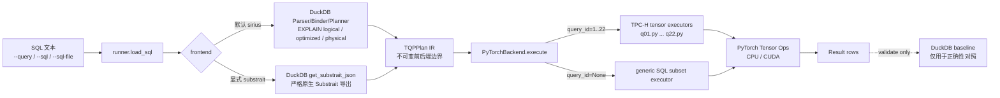
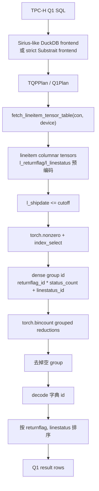

# 当前架构：DuckDB/Sirius-like 前端 → TQP IR → PyTorch/CUDA 后端

本文档描述当前仓库的真实执行链路。项目目标不是把 DuckDB 当执行引擎，也不是在失败时偷偷回退到 DuckDB；当前默认路径是：DuckDB 负责 SQL 解析/绑定/计划准入，TQP IR 作为前后端边界，PyTorch 负责 CPU/CUDA 上的算子执行。

## 1. 一图看懂端到端链路



关键边界：

- **默认前端是 `sirius`**：使用 DuckDB 的 parser/binder/planner/optimizer 做 SQL 准入，并读取 `EXPLAIN` 计划元数据。
- **Substrait 不是默认路径**：`--frontend substrait` 是严格实验路径，只使用 DuckDB 原生 `get_substrait_json(original_sql)`；导不出就显式失败。
- **DuckDB 不做执行回退**：validation 会用 DuckDB 结果做比较，但 PyTorch 输出来自 PyTorch 后端，不来自 DuckDB rows。
- **前端准入 ≠ 后端全支持**：DuckDB 能解析/计划的 SQL 可以被前端接收；后端当前只执行 TPC-H Q1-Q22 模板和有限 generic SQL subset。

## 2. 模块分层

| 层级 | 关键文件 | 职责 |
| --- | --- | --- |
| CLI | `scripts/run_query.py`, `scripts/validate_query.py`, `scripts/benchmark_query.py` | 解析命令行参数，选择 SQL 来源、frontend、device、benchmark 配置。 |
| Runner | `tpch_torch/runner.py` | 读取 SQL，调用前端编译 `TQPPlan`，交给 PyTorch 后端执行，必要时做 validation。 |
| Frontend | `tpch_torch/frontend/sirius.py`, `tpch_torch/frontend/substrait.py` | 把原始 SQL 编译为 `TQPPlan`。 |
| Planner bridge | `tpch_torch/planner.py`, `tpch_torch/substrait.py` | 对接 DuckDB `EXPLAIN` 和 `get_substrait_json()`。 |
| IR | `tpch_torch/ir/plan.py` | 保存不可变的前后端边界对象。 |
| Backend | `tpch_torch/backend/pytorch.py`, `tpch_torch/backend/generic.py` | 分发到 TPC-H 模板或 generic SQL subset，并执行 PyTorch tensor 算子。 |
| Tensor storage | `tpch_torch/storage.py`, `tpch_torch/duckdb_bridge.py` | 从 DuckDB columnar fetch 到 tensor table，处理字典编码等。 |
| TPC-H kernels | `tpch_torch/queries/q01.py` ... `q22.py` | 正确性优先的 TPC-H PyTorch 实现。 |
| Reusable operators | `tpch_torch/operators.py`, `tpch_torch/relational.py` | 分组聚合、lookup index、比较、结果对齐等可复用算子。 |
| Compression experiments | `tpch_torch/compressed.py`, `tpch_torch/queries/q06.py` | RLE/Index/Plain mask 原型，当前 Q6 可用 `--compressed-masks` 显式开启。 |
| Benchmark | `tpch_torch/benchmark.py` | 冷/热端到端计时，统计 min/median/mean/p95/max/std。 |

## 3. Runner：保持编排层足够薄

`tpch_torch/runner.py` 只负责编排，不把 SQL 解析、算子执行或 fallback 逻辑塞进来：

```python
def run_sql_with_frontend(
    con: duckdb.DuckDBPyConnection,
    sql: str,
    device: str = "cpu",
    frontend: FrontendName = "sirius",
    use_compressed_masks: bool = False,
) -> QueryResult:
    _validate_device(device)
    plan = compile_tqp_plan(con, sql, frontend)
    rows = PyTorchBackend().execute(
        con,
        plan,
        device=device,
        use_compressed_masks=use_compressed_masks,
    )
    return QueryResult(query_id=plan.query_id, rows=rows)
```

前端选择是显式的：

```python
def compile_tqp_plan(
    con: duckdb.DuckDBPyConnection,
    sql: str,
    frontend: FrontendName = "sirius",
) -> TQPPlan:
    if frontend == "sirius":
        return compile_sirius_plan(con, sql)
    if frontend == "substrait":
        return compile_substrait_plan(con, sql)
    raise ValueError(f"unknown frontend: {frontend}")
```

Validation 复用同一条 PyTorch 执行链路，再与 DuckDB baseline 比较：

```python
def validate_sql_with_frontend(...):
    result = run_sql_with_frontend(con, sql, device=device, frontend=frontend)
    duckdb_rows = run_duckdb_sql(con, sql)
    max_abs_error = compare_rows(duckdb_rows, result.rows)
    return SQLValidationResult(...)
```

## 4. TQPPlan：当前前后端边界

当前 IR 仍然紧凑，目标是先保证端到端链路干净，再逐步演进为更完整的显式 operator graph。

```python
FrontendName = Literal["sirius", "substrait"]

@dataclass(frozen=True)
class DuckDBPlanMetadata:
    logical_plan: str = ""
    logical_opt: str = ""
    physical_plan: str = ""

@dataclass(frozen=True)
class TQPPlan:
    query_id: int | None
    source_sql: str
    frontend: FrontendName
    duckdb_metadata: DuckDBPlanMetadata | None = None
    plan_json: dict[str, Any] | None = None
    generic_plan: Any | None = None
    generic_error: str | None = None
```

字段含义：

- `query_id`：识别出的 TPC-H 查询编号；非 TPC-H SQL 为 `None`。
- `source_sql`：未经改写的原始 SQL。
- `frontend`：`sirius` 或 `substrait`。
- `duckdb_metadata`：Sirius-like 前端捕获的 DuckDB plan 文本。
- `plan_json`：strict Substrait 前端导出的真实 Substrait JSON。
- `generic_plan`：当前 generic SQL subset 的可执行计划。
- `generic_error`：SQL 被前端接收但后端暂不支持时的明确原因。

## 5. 默认 Sirius-like 前端

默认前端复用 DuckDB 的 SQL parser/binder/planner/optimizer 能力，思路与 Sirius 类似：不要让 Substrait exporter 覆盖率成为整个系统的阻塞点。

```python
def compile_sirius_plan(con: duckdb.DuckDBPyConnection, sql: str) -> TQPPlan:
    duckdb_plan = export_duckdb_logical_plan(con, sql)
    generic_plan = None
    generic_error = None
    try:
        query_id = identify_tpch_query(sql)
    except UnsupportedPlanError:
        query_id = None
        try:
            generic_plan = parse_generic_sql(sql)
        except UnsupportedPlanError as exc:
            generic_error = str(exc)
    return TQPPlan(
        query_id=query_id,
        source_sql=sql,
        frontend="sirius",
        duckdb_metadata=DuckDBPlanMetadata(...),
        generic_plan=generic_plan,
        generic_error=generic_error,
    )
```

DuckDB 计划准入函数会直接对原始 SQL 执行 `EXPLAIN`：

```python
def export_duckdb_logical_plan(con: object, sql: str) -> DuckDBLogicalPlan:
    try:
        con.execute("PRAGMA explain_output='all'")
        rows = con.execute(f"EXPLAIN {sql}").fetchall()
    except duckdb.Error as exc:
        raise DuckDBPlannerError(f"DuckDB EXPLAIN failed: {exc}") from exc
    sections = {str(name): str(plan) for name, plan in rows}
    return DuckDBLogicalPlan(
        logical_plan=sections.get("logical_plan", ""),
        logical_opt=sections.get("logical_opt", ""),
        physical_plan=sections.get("physical_plan", ""),
    )
```

## 6. Strict Substrait 前端

Strict Substrait 路径只做一件事：把原始 SQL 交给 DuckDB 原生 Substrait exporter。

```python
def compile_substrait_plan(con: duckdb.DuckDBPyConnection, sql: str) -> TQPPlan:
    return TQPPlan(
        query_id=identify_tpch_query(sql),
        source_sql=sql,
        frontend="substrait",
        plan_json=export_substrait_json(con, sql),
    )
```

如果 DuckDB 1.2.x exporter 对某些 TPC-H 形状失败，例如 `DELIM_JOIN` 或 `MARK` join 相关限制，该路径会抛出 `DuckDBSubstraitError`。默认链路不依赖这个 exporter 覆盖率。

## 7. PyTorch 后端分发

`PyTorchBackend` 只消费 `TQPPlan`，不会重新解析 SQL：

```python
class PyTorchBackend:
    def execute(
        self,
        con,
        plan: TQPPlan,
        device: str = "cpu",
        use_compressed_masks: bool = False,
    ) -> list[dict[str, Any]]:
        if plan.query_id is None:
            if plan.generic_plan is None:
                detail = plan.generic_error or "generic SQL plan is missing executable operator plan"
                raise UnsupportedPlanError(f"generic SQL is not executable by PyTorch backend: {detail}")
            return execute_generic_sql_plan(con, plan.generic_plan, device=device)
        if plan.query_id == 1:
            q1_plan = _compile_q1_plan(plan.plan_json)
            from tpch_torch.duckdb_bridge import fetch_lineitem_tensor_table
            return execute_q1(fetch_lineitem_tensor_table(con, device=device), q1_plan)
        module_name = _EXECUTOR_BY_QUERY.get(plan.query_id)
        ...
```

TPC-H Q1-Q22 都有 PyTorch executor。Q6 额外支持 `--compressed-masks`，仅改变 PyTorch 端 mask 表达，不改变 SQL、前端、validation baseline 或存储格式。

## 8. Q1 分层与实现

### Q1 执行图



### Q1 关键代码片段

后端对 Q1 有专门分支，用真实 Substrait JSON 或 canonical Q1 plan 构造 `Q1Plan`：

```python
if plan.query_id == 1:
    q1_plan = _compile_q1_plan(plan.plan_json)
    from tpch_torch.duckdb_bridge import fetch_lineitem_tensor_table
    return execute_q1(fetch_lineitem_tensor_table(con, device=device), q1_plan)
```

`fetch_lineitem_tensor_table()` 用 DuckDB columnar fetch，并把低基数字符串列预编码成 int id：

```python
"l_returnflag": torch.as_tensor(columnar["l_returnflag"], dtype=torch.int64, device=device)
"l_linestatus": torch.as_tensor(columnar["l_linestatus"], dtype=torch.int64, device=device)
```

Q1 先过滤 shipdate，再为两列 group key 构造 dense group id：

```python
mask = table.columns["l_shipdate"] <= plan.shipdate_cutoff_yyyymmdd
selected_rows = torch.nonzero(mask).flatten()

status_count = len(table.dictionaries["l_linestatus"])
group_ids = (columns["l_returnflag"].to(dtype=torch.int64) * status_count) + columns[
    "l_linestatus"
].to(dtype=torch.int64)
```

聚合用 `torch.bincount` 完成 grouped sum/count，再由 sum/count 得到 avg：

```python
count_order = torch.bincount(group_ids, minlength=group_count)
sum_qty = torch.bincount(group_ids, weights=quantity, minlength=group_count)
sum_base_price = torch.bincount(group_ids, weights=extendedprice, minlength=group_count)
sum_discount = torch.bincount(group_ids, weights=discount, minlength=group_count)
```

当前 Q1 优化重点是减少 Python row loop，把主聚合路径放到 PyTorch tensor operator 中；最终 rows 的 decode/materialization 仍在 host 侧完成。

## 9. 当前 SQL 与 TPC-H 支持边界

### Generic SQL subset

PyTorch generic 后端当前支持：

```text
single-table SELECT
WHERE comparisons / IN / LIKE / AND / OR / NOT
column projection 与简单 arithmetic projection
COUNT(*), COUNT(col), SUM, MIN, MAX, AVG
simple GROUP BY
ORDER BY output columns ASC / DESC
LIMIT
```

暂不支持的 generic SQL 会显式失败，包括 joins、subqueries、windows、set operations、HAVING 等。失败是后端能力边界，不是前端无法接收 SQL。

### TPC-H 支持矩阵

| Query set | 默认 Sirius-like frontend | Strict DuckDB Substrait frontend | PyTorch backend |
| --- | --- | --- | --- |
| Q1, Q3, Q5, Q6, Q7, Q8, Q9, Q10, Q11, Q12, Q13, Q14, Q15, Q18, Q19 | yes | yes | yes |
| Q2, Q4, Q16, Q17, Q20, Q21, Q22 | yes | DuckDB 1.2.x exporter blocked | yes |

## 10. 冷/热计时方法

`tpch_torch/benchmark.py` 计时的是与 `tpch-torch-run` 同一条端到端路径：

```text
SQL text
  -> run_sql_with_frontend()
  -> compile_tqp_plan()
  -> PyTorchBackend.execute()
  -> tensor executor
  -> materialized result rows
```

冷查询：每个样本新建 DuckDB connection，运行完整 frontend + backend + materialization，然后关闭连接。它不刷新 OS page cache，也不重启 Python。

热查询：复用一个 DuckDB connection，先跑 `--warmup-runs`，再记录 `--hot-runs`。

CUDA 计时在每个样本前后调用 `torch.cuda.synchronize()`，报告 wall-clock ms，因此包含 CPU-side frontend/fetch/materialization 与 GPU kernel 时间。需要 kernel-only 细分时，应使用 Nsight 或 PyTorch profiler。

## 11. 架构演进方向

下一步希望把 `TQPPlan` 从紧凑边界对象逐步扩展为显式 operator graph：

```text
Scan -> Filter -> Join -> Aggregate -> Sort -> Limit
```

这样才能把更多 TPC-H 模板逻辑沉淀成可复用算子，并继续实现压缩列执行、join index、fusion、scheduling、compiler lowering 等 Roadmap 项。
