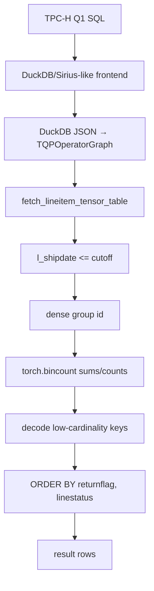

# 当前架构：DuckDB/Sirius-like 前端 → TQP IR → PyTorch Graph Nodes

本文档描述当前仓库的真实执行链路。DuckDB 负责 SQL 解析、绑定、计划准入和 JSON physical plan 输出；Sirius-like 前端 lowering 成 `TQPOperatorGraph`；PyTorch 后端在 CPU/CUDA tensor 上执行 graph nodes。DuckDB 只在 validation 中作为 baseline，不是执行 fallback。

## 1. 一图看懂端到端链路

```mermaid
flowchart LR
    SQL["SQL 文本<br/>--query / --sql / --sql-file"] --> Runner["runner.load_sql"]
    Runner --> Frontend{"frontend"}
    Frontend -->|默认 sirius| Sirius["DuckDB parser/binder/planner<br/>EXPLAIN + JSON physical plan"]
    Frontend -->|严格 substrait| Substrait["DuckDB native Substrait exporter"]
    Sirius --> Graph["TQPOperatorGraph"]
    Substrait --> Plan["TQPPlan"]
    Graph --> Plan
    Plan --> Backend["PyTorchBackend"]
    Backend --> GraphExec["PyTorchGraphExecutor"]
    GraphExec -->|Q1/Q6| Prim["直接 graph primitives"]
    GraphExec -->|Q2-Q22| Recipes["TPC-H graph recipes"]
    Recipes --> Nodes["通用 graph_nodes"]
    GraphExec -->|Generic SQL subset| Generic["generic.py"]
    Prim --> Torch["PyTorch tensor ops<br/>CPU / CUDA"]
    Nodes --> Torch
    Generic --> Torch
    Torch --> Rows["结果 rows"]
    Rows -. correctness only .-> DuckDB["DuckDB baseline"]
```



## 2. 当前后端契约

- TPC-H Q1-Q22 都必须携带 DuckDB JSON lowering 出来的真实 `TQPOperatorGraph` root。
- `OperatorKind.COMPILED_TPCH` root 会被拒绝；不再有 compiled/template fallback。
- Q1/Q6 在 `tpch_torch/backend/graph.py` 中执行直接 graph primitives。
- Q2-Q22 在 `tpch_torch/backend/tpch_graph_qXX.py` 中作为显式 graph recipe 执行，并组合 `tpch_torch/backend/graph_nodes.py` 的通用节点。
- 非 TPC-H SQL 使用显式 generic SQL subset；不支持的 SQL shape 抛出 `UnsupportedPlanError`。

## 3. 模块分层

| 层级 | 关键文件 | 职责 |
| --- | --- | --- |
| CLI | `scripts/run_query.py`, `scripts/validate_query.py`, `scripts/benchmark_query.py` | 解析 SQL 来源、frontend、device、validation/benchmark 参数。 |
| Runner | `tpch_torch/runner.py` | 薄编排：读取 SQL，编译 frontend plan，调用 backend，必要时 validation。 |
| Frontend | `tpch_torch/frontend/sirius.py`, `tpch_torch/frontend/substrait.py` | 把原始 SQL 编译成 `TQPPlan`。 |
| DuckDB lowering | `tpch_torch/duckdb_plan_json.py`, `tpch_torch/planner.py` | 导出 DuckDB 文本/JSON plan，并把 JSON node lowering 到 `TQPOperatorGraph`。 |
| IR | `tpch_torch/ir/plan.py`, `tpch_torch/operator_graph.py` | 不可变前后端边界。 |
| Backend dispatch | `tpch_torch/backend/pytorch.py`, `tpch_torch/backend/graph.py` | TPC-H 强制走 graph；分发 Q1/Q6、Q2-Q22 recipes、generic SQL。 |
| Graph nodes | `tpch_torch/backend/graph_nodes.py` | Scan、filter、lookup join、semi/anti join、scalar subquery、grouped scalar subquery、CTE materialization、aggregate、sort/limit helpers。 |
| TPC-H recipes | `tpch_torch/backend/tpch_graph_q02.py` ... `q22.py` | Q2-Q22 的 query-specific graph recipe；不调用旧 `tpch_torch.queries.qXX` 模板。 |
| Tensor operators | `tpch_torch/operators.py`, `tpch_torch/compressed.py` | grouped reductions、dense group id、top-k、Plain/RLE/Index mask 原型。 |

## 4. 关键代码片段

Sirius-like 前端把 DuckDB JSON physical plan 挂到 `TQPPlan.operator_graph`：

```python
physical_plan_json = export_duckdb_physical_plan_json(con, sql)
operator_graph = lower_duckdb_json_to_operator_graph(sql, query_id, physical_plan_json)
return TQPPlan(..., operator_graph=operator_graph)
```

PyTorch 后端拒绝没有 graph 的 TPC-H plan：

```python
if plan.operator_graph is not None:
    return PyTorchGraphExecutor().execute(con, plan, device=device)
if plan.query_id is not None:
    raise UnsupportedPlanError(
        f"TPC-H Q{plan.query_id} requires a frontend-lowered TQP operator graph"
    )
```

通用 graph nodes 暴露 join/subquery/aggregate 形态：

```python
@dataclass(frozen=True)
class AntiJoinNode:
    probe_keys: torch.Tensor
    build_keys: torch.Tensor

    def execute(self) -> torch.Tensor:
        return ~SemiJoinNode(self.probe_keys, self.build_keys).execute()

@dataclass(frozen=True)
class GroupedScalarSubqueryNode:
    keys: torch.Tensor
    values: torch.Tensor

    def lookup(self, probe_keys, missing_value=-1):
        build_key, probe_key = _packed_lookup_keys(...)
        return lookup_tensor_values(build_key, self.values, probe_key, missing_value)
```

Q20 的 correlated grouped scalar subquery 已经表达为 graph-node 组合：

```python
shipped_quantity_by_pair = GroupedScalarSubqueryNode.sum(
    (lineitem.columns["l_partkey"][ship_mask], lineitem.columns["l_suppkey"][ship_mask]),
    lineitem.columns["l_quantity"][ship_mask],
)
shipped_quantity = shipped_quantity_by_pair.lookup(
    (partsupp.columns["ps_partkey"], partsupp.columns["ps_suppkey"]),
    missing_value=0.0,
)
qualifying_suppkeys = torch.unique(partsupp.columns["ps_suppkey"][
    SemiJoinNode(partsupp.columns["ps_partkey"], forest_partkeys).execute()
    & (partsupp.columns["ps_availqty"] > 0.5 * shipped_quantity)
])
```

## 5. Q1 分层实现图



Q1 的 scan/filter/group/reduce 主路径都在 tensor 中完成；host 侧只做最终 grouped rows 的 decode/materialization。

## 6. SQL 支持边界

Sirius-like 前端能接收 DuckDB 可解析和计划的 SQL；PyTorch 后端当前可执行：

```text
TPC-H Q1-Q22：TQPOperatorGraph + PyTorch graph nodes
generic SQL：single-table SELECT / WHERE / projection / aggregate / GROUP BY / ORDER BY / LIMIT
```

Generic joins、generic subqueries、windows、set operations、HAVING 仍显式失败。下一步架构目标是把 query-id recipe dispatch 进一步替换为 DuckDB physical-plan interpreter，让任意支持的 plan node 自动 lowering 到同一套 `graph_nodes`。

## 7. TPC-H 支持矩阵

| Query set | 默认 Sirius-like frontend | Strict DuckDB Substrait frontend | PyTorch backend |
| --- | --- | --- | --- |
| Q1, Q3, Q5, Q6, Q7, Q8, Q9, Q10, Q11, Q12, Q13, Q14, Q15, Q18, Q19 | yes | yes | yes |
| Q2, Q4, Q16, Q17, Q20, Q21, Q22 | yes | DuckDB 1.2.x exporter blocked | yes |

Strict Substrait 的 blocked 是 DuckDB exporter 覆盖限制，不是 PyTorch backend fallback。

## 8. 冷/热计时方法

`tpch_torch/benchmark.py` 计时的是与 `tpch-torch-run` 同一条端到端路径：

```text
SQL text -> run_sql_with_frontend() -> compile_tqp_plan() -> PyTorchBackend.execute() -> tensor executor -> materialized result rows
```

冷查询：每个样本新建 DuckDB connection，运行完整 frontend + backend + materialization，然后关闭连接。热查询：复用一个 DuckDB connection，先跑 warmup，再记录 hot samples。CUDA 计时在每个样本前后调用 `torch.cuda.synchronize()`。

## 9. 验证命令

```bash
timeout 60 /work/torch-query-gpu/.venv/bin/python -m pytest -q
timeout 60 /work/torch-query-gpu/.venv/bin/python -m compileall -q tpch_torch scripts
```
