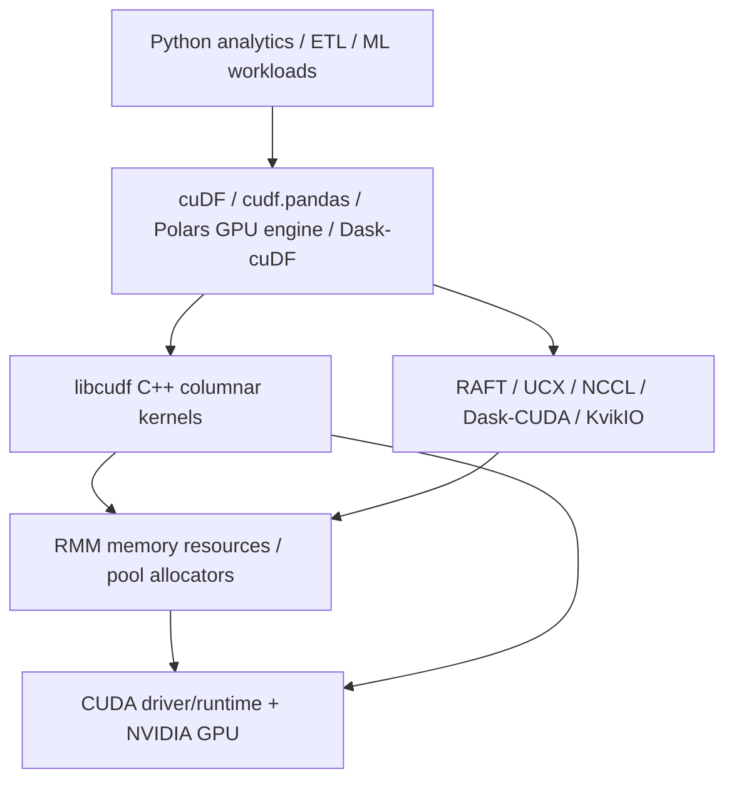
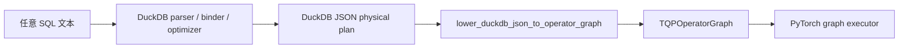
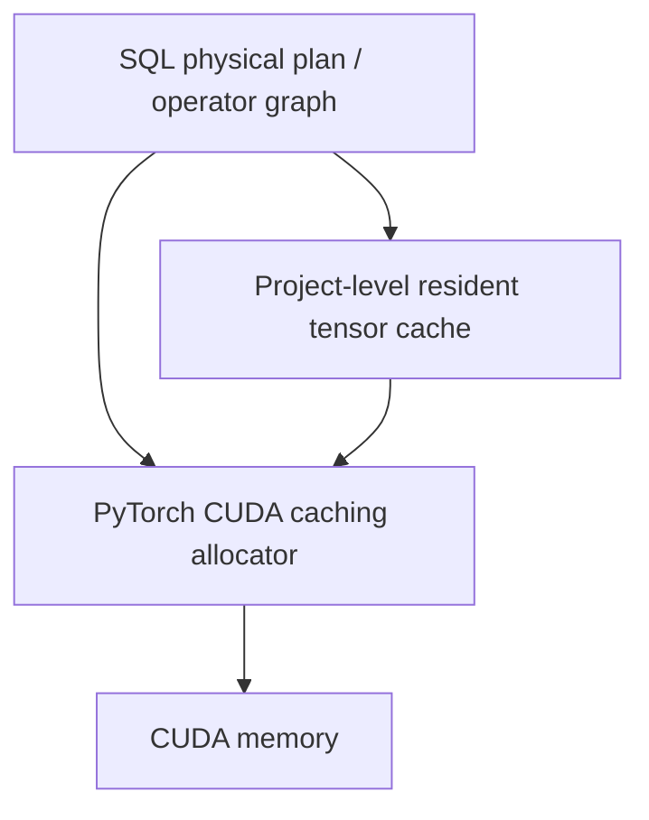

# GPU SQL / Tensor Query 软件栈分析：RAPIDS、Sirius、TQP 与 CoddSpeed

本文分析 GPU SQL / GPU analytics 的几条代表性路线，并说明本仓库当前为什么选择
“DuckDB/Sirius-like 前端 + TQP-style operator graph + PyTorch CUDA tensor backend”。
重点关注四个问题：现有软件栈、软件生态、显存管理，以及到底复用了哪些 CUDA 能力。

> 说明：仓库已经下载了 TQP 和 compressed-data GPU SQL 论文 PDF；TQP++ 与
> CoddSpeed 目前只有公开 Microsoft Research 页面和仓库内记录，全文 PDF 在当前环境不可达。
> 因此本文对 TQP++ / CoddSpeed 的描述仅基于公开摘要和本仓库
> [`docs/papers/README.md`](papers/README.md) 的来源记录，不伪造全文细节。

## 1. 结论摘要

- **RAPIDS/cuDF** 是成熟的 NVIDIA GPU DataFrame / analytics 生态：底层是
  CUDA、C++ columnar kernels、`libcudf`、RMM 显存 allocator、以及 Dask-cuDF、cuML、cuGraph、RAFT、UCX/NCCL 等生态。
  它的优势是工程成熟、列式算子强、与 Python DataFrame 生态接得好；但它本身不是
  “SQL parser + optimizer + distributed query scheduler” 的完整数据库内核。
- **Sirius-like 路线** 的核心价值是复用数据库前端能力：让 DuckDB 负责 SQL 解析、绑定、优化/物理计划导出，再把计划 lowering 到 GPU 后端。
  本仓库采用的是这种思想，而不是直接复刻某个外部 Sirius 代码库。
- **TQP / TQP++ / CoddSpeed** 关注的是把关系查询表达成 tensor program / tensor operator graph，
  复用 PyTorch、TensorFlow、ML compiler 或 TCR 中已有的 GPU 算子、调度和设备管理能力。
  这条线的关键不是“再写一个 cuDF”，而是把 SQL lowering 到 tensor primitives。
- **本仓库当前定位**：

  ```text
  SQL → DuckDB/Sirius-like frontend → TQPOperatorGraph
      → PyTorch physical interpreter / fused primitives → torch CUDA ops
  ```

  也就是说：前端尽量复用 DuckDB，后端尽量复用 PyTorch 里已有 CUDA 算子；当前没有接入 cuDF/RAPIDS/RMM。
- **显存管理边界**：RMM 解决的是 RAPIDS 生态内的 GPU allocation / pooling / memory resource 统一问题；
  PyTorch 也有自己的 CUDA caching allocator。本仓库当前主要依赖 PyTorch allocator 和 resident tensor cache，
  还没有实现 SQL-aware 的显存生命周期规划、spill、operator scheduling 或多 GPU residency planner。

## 2. 现有软件栈：CUDA / RAPIDS / cuDF / RMM

RAPIDS 的典型分层如下：



### 2.1 cuDF / libcudf

cuDF 是 Python GPU DataFrame 库，建立在 Apache Arrow columnar memory format 之上，
提供类似 pandas 的 API，并把支持的 DataFrame 操作放到 GPU 上执行。其底层 `libcudf`
提供 C++ 列式算子与数据结构，覆盖过滤、投影、聚合、join、排序、字符串、时间类型等 DataFrame/analytics 场景。

这意味着 RAPIDS 的复用点是：

- 复用 `libcudf` 已经手写和调优过的 CUDA/C++ columnar kernels；
- 复用 cuDF Python API、cudf.pandas 兼容层、Polars GPU engine、Dask-cuDF 分布式执行入口；
- 复用 RAPIDS 统一的 device memory resource 和相关工具链。

但 cuDF 更像 GPU DataFrame engine，而不是单独完整的 SQL DBMS。要跑 SQL，仍然需要 SQL parser、binder、optimizer、logical/physical plan、cost model、transaction/catalog、distributed scheduler 等上层能力，或者通过 Spark、BlazingSQL 历史路线、Polars SQL/懒执行、DuckDB/外部 planner 等系统来补齐。

### 2.2 RMM：管理 allocation，不等于完整查询显存优化器

RMM 官方定位是 RAPIDS Memory Manager：为 C++ 和 Python 分配、管理 GPU memory。
它的关键能力包括：

- 在 RAPIDS 库之间统一 device memory resource；
- 提供 pool / arena / binning / CUDA async 等 allocator 策略；
- 减少频繁 `cudaMalloc` / `cudaFree` 带来的同步和碎片化成本；
- 支持显存统计、profiling、stream-aware allocation 等基础设施。

不过需要区分两层概念：

| 层级 | RMM 主要解决 | RMM 不自动解决 |
| --- | --- | --- |
| Allocation 层 | 给 GPU 算子分配/释放 device memory；统一 RAPIDS 库 allocator；减少分配开销。 | 不理解 SQL operator DAG 的全局生命周期、join/build/probe 的峰值显存、query-level spill 策略。 |
| Query execution 层 | 可作为执行引擎的显存分配后端。 | 不自动决定中间结果何时 materialize、何时释放、何时重算、何时压缩、何时跨 GPU 搬运。 |
| System scheduling 层 | 提供 allocator 和统计接口。 | 不自动完成多查询 admission control、HBM residency planning、NVLink/PCIe/InfiniBand 数据移动规划。 |

所以“用了 RMM”并不等于“解决了 GPU SQL 的显存管理”。真正困难的 GPU SQL memory management
通常包括：中间列生命周期、pipeline breaker、hash table size 估计、spill 到 host/NVMe、压缩列常驻、
多 GPU partition、stream/event 同步、查询间资源隔离等。这些通常需要 query engine 自己做计划和调度。

### 2.3 PyTorch 的 CUDA memory management

PyTorch 也不是裸 `cudaMalloc`。PyTorch CUDA backend 使用 caching memory allocator
来加速 GPU memory allocation，并提供 `memory_allocated()`、`memory_reserved()`、
`max_memory_allocated()`、`empty_cache()`、`PYTORCH_ALLOC_CONF`、`cudaMallocAsync` backend 等工具。

本仓库当前复用的是 PyTorch allocator，而不是 RMM：

```text
torch tensor allocation → PyTorch CUDA caching allocator → CUDA runtime/driver
```

这对 TQP-style 系统很自然，因为 tensor primitives 全部在 PyTorch 里运行；
但代价是 allocator 并不知道 SQL plan 的语义，也不会自动进行 SQL-aware 中间结果复用、释放、spill 或压缩布局规划。
当前仓库为 Q1 做的 resident tensor cache 是 query/data-loading 层的缓存优化，不是通用 GPU memory manager。

## 3. Sirius-like 路线：复用数据库前端

本文用 “Sirius-like” 指一种系统架构思想：复用 DuckDB 等成熟数据库前端能力，
然后把物理计划接到 GPU backend。对本仓库而言，真实实现是：



这条路线复用的是：

- DuckDB 的 SQL parser / binder / type checking；
- DuckDB 对 TPC-H 和常见 SQL shape 的 logical/physical planning；
- DuckDB JSON physical plan 作为前后端边界；
- 本仓库自己的 `TQPOperatorGraph` 与 PyTorch physical interpreter。

它解决了早期直接依赖 DuckDB Substrait exporter 的一个核心问题：DuckDB 原生 Substrait 导出对复杂 TPC-H 查询覆盖不完整，
而 DuckDB 自己的 physical plan 覆盖更广。因此本仓库保留 strict Substrait 路径作为实验/兼容路径，
默认则走 Sirius-like 的 DuckDB JSON physical plan lowering。

需要强调：本仓库目前不是 RAPIDS/cuDF 后端，也不是完整 Sirius 代码复刻。它只借鉴“复用 DuckDB 前端、替换后端”的路径。

## 4. TQP / TQP++ / CoddSpeed 路线

### 4.1 TQP：SQL → tensor program

TQP 的核心思想是把 SQL query 转换成 tensor programs，并在 PyTorch 等 tensor computation runtimes 上执行。
论文强调避免 data-dependent Python control flow，把关系算子表达成 tensor routines。
这对 GPU SQL 的意义是：

- 不必为每个 SQL 算子从零手写 CUDA kernel；
- 可以复用 PyTorch/TensorFlow/TCR 已有的 GPU kernel、allocator、device placement、profiling 和调度基础设施；
- SQL operator 可以 lowering 成 `sort`、`gather`、`scatter`、`bincount`、`topk`、`searchsorted`、`unique`、`where` 等 tensor primitives；
- 系统优化重点从“写 CUDA kernel”转移到“如何把 relational algebra 编译成少量、高效、可融合的 tensor primitive graph”。

本仓库当前和 TQP 最接近的地方是：

```text
DuckDB physical plan node
  → TQP graph / physical interpreter node
  → torch tensor primitive(s)
  → CUDA implementation inside PyTorch
```

例如 Q1 的过滤、投影、grouped aggregate 可以走 fused physical primitive，底层使用 mask、dense group id、`torch.bincount`、排序/重排等 tensor 算子组合。

### 4.2 TQP++：ML compiler native 的进一步系统化

根据本仓库保存的 Microsoft Research 页面笔记，TQP++ 的公开摘要强调：

- ML-compiler-native analytical query processor；
- 使用 Antares 编译框架；
- tiered GPU resource scheduling；
- map-reduce-oriented fusion；
- multi-gated execution graph，根据运行时数据选择 operator algorithms。

这些点说明 TQP++ 已经不只是“把 SQL 翻译成 PyTorch API 调用”，而是在更系统地利用 ML compiler、fusion、调度和 runtime gating。
本仓库当前只实现了第一阶段：DuckDB plan lowering + PyTorch graph executor + 少量 fused primitives，
还没有完整 ML compiler backend 或 runtime algorithm gating。

### 4.3 CoddSpeed：工程化硬件加速查询

根据公开摘要和仓库记录，CoddSpeed 面向 Microsoft Fabric 中的硬件加速分析，
包含从 TQP 派生的 GPU execution engine，并把数据移动作为系统级问题处理，涉及 GPU、FPGA、ASIC、NVLink、InfiniBand 等硬件/网络。

这说明 CoddSpeed 的关注点比单机 PyTorch prototype 更靠系统工程：

- 多种 accelerator 的抽象；
- 查询执行与 Fabric 数据平台集成；
- 分布式数据移动、网络拓扑、host/device 传输；
- 加速器资源调度与系统可靠性。

本仓库目前还处在单机/单进程 PyTorch backend 阶段，不声称覆盖 CoddSpeed 的系统级能力。

## 5. RAPIDS/cuDF vs TQP/CoddSpeed vs 本仓库

| 维度 | RAPIDS / cuDF | Sirius-like + RAPIDS 风格 | TQP / TQP++ / CoddSpeed | 本仓库当前实现 |
| --- | --- | --- | --- | --- |
| 前端 | DataFrame API、cudf.pandas、Polars GPU engine、Dask-cuDF；SQL 需外部 planner。 | DuckDB / 其他 SQL 前端负责 parser、binder、optimizer。 | SQL lowering 到 tensor program / ML compiler graph。 | DuckDB JSON physical plan lowering 到 `TQPOperatorGraph`。 |
| 后端 | `libcudf` C++ columnar kernels。 | GPU DataFrame / SQL execution backend。 | PyTorch/TCR/ML compiler tensor runtime；CoddSpeed 进一步工程化。 | PyTorch physical interpreter 和 graph nodes。 |
| 算子来源 | RAPIDS 自己实现和维护的 CUDA/C++ kernels。 | 取决于后端，可能是 cuDF/libcudf。 | tensor runtime CUDA kernels 或 ML compiler 生成 kernels。 | `torch` 内置 CUDA tensor ops + 少量 Python graph orchestration。 |
| 显存管理 | RMM memory resource / pool allocator。 | 可复用 RMM，但仍需 query-level memory planner。 | 复用 tensor runtime allocator；研究重点更多在 lowering/fusion/scheduling。 | PyTorch CUDA caching allocator；Q1 resident cache；没有通用 SQL-aware memory manager。 |
| 优化重点 | 列式 kernel 性能、DataFrame API、RAPIDS 生态互操作。 | 前端计划与 GPU backend 兼容、算子覆盖。 | tensor lowering、fusion、减少 materialization、resource scheduling。 | TPC-H physical plan 覆盖、operator graph、Q1 fusion、generic SQL lowering。 |
| 生态优势 | NVIDIA 官方生态成熟，cuML/cuGraph/Dask/UCX/KvikIO 等完整。 | 可复用成熟 SQL optimizer。 | 可复用 ML/tensor runtime 和 compiler 生态。 | 代码轻，依赖少，能直接研究 SQL→tensor primitive。 |
| 主要短板 | 不是完整 SQL DBMS；接 SQL 需要额外层。 | 计划格式和后端能力匹配复杂。 | PyTorch 算子粒度、kernel launch、中间 materialization、SQL semantics gap。 | 性能尚弱；operator coverage/fusion/memory planning 仍在建设。 |

## 6. “复用的是什么能力”：RAPIDS 路线 vs PyTorch 路线

### 6.1 RAPIDS/cuDF 复用能力

RAPIDS/cuDF 路线复用的是 NVIDIA 数据处理生态本身：

```text
SQL/DataFrame operator
  → libcudf columnar primitive
  → hand-written CUDA/C++ kernel
  → RMM allocation
  → CUDA runtime
```

优点是 columnar analytics 算子成熟、接口稳定、和 GPU 数据科学生态一致。
缺点是如果目标是研究 TQP-style SQL-to-tensor lowering，cuDF 会把很多算子语义封装在 `libcudf` 内部，
不利于观察和控制每个 SQL operator 如何拆成 tensor primitive、如何融合、如何映射到 PyTorch backend。

### 6.2 TQP / 本仓库复用能力

TQP-style 路线复用的是 tensor runtime：

```text
SQL/relational operator
  → tensor primitive graph
  → torch.searchsorted / torch.argsort / torch.topk / torch.bincount /
     torch.unique / torch.where / torch.index_select / scatter/index_add ...
  → PyTorch CUDA kernels + PyTorch allocator
```

本仓库因此可以把 SQL execution 拆成更透明的 PyTorch primitives。例如：

- selection/filter：boolean mask、`torch.where`、mask gather；
- projection/expression：tensor arithmetic、date/int/string dictionary expressions；
- group-by：dense group id、`torch.unique`、`torch.bincount`、`index_add` / scatter reductions；
- join：sorted key、`searchsorted`、hash/index table、membership probe；
- top-k/order：`torch.topk`、`argsort`、gather；
- compressed experiments：RLE / Index mask primitives，避免完全展开 rows。

代价也很直接：

- PyTorch primitive 不一定等价于数据库 kernel 的最佳实现；
- 多个 tensor op 之间会产生中间 tensor 和 kernel launch overhead；
- PyTorch allocator 不知道 SQL operator DAG 的全局生命周期；
- string、decimal、null semantics、复杂 join、window、subquery 等 SQL 特性需要额外 lowering 规则；
- 要达到论文级性能，需要 fusion、plan cache、resident layout、compressed execution 和更强 memory scheduling。

## 7. 显存管理：为什么“现在做得不多”是事实边界

本仓库当前 GPU memory 策略可以概括为三层：



已有能力：

- 通过 PyTorch tensor 在 CUDA device 上执行算子；
- 热查询可以复用已加载/转换过的 resident tensors；
- Q1 fused primitive 减少部分中间 materialization；
- benchmark 区分 cold/hot timing，避免把一次性加载成本和热路径 kernel 成本混在一起。

尚未具备的能力：

- query-level tensor lifetime analysis；
- hash join / aggregate 的峰值显存估算；
- 多 operator pipeline 的显存复用计划；
- spill 到 host/NVMe；
- RMM/cuDF/Arrow/DLPack 统一显存池；
- 多 GPU partition 与数据移动规划；
- 基于压缩元数据的 HBM residency planner。

因此，如果短期目标是“让 SQL → operator graph → PyTorch/CUDA 通路干净、可研究”，
继续依赖 PyTorch allocator 是合理的。如果目标转向生产级 GPU SQL engine，就必须把上述 SQL-aware memory manager 补上，
或者接入 RAPIDS/RMM 后再在 query engine 层实现生命周期、spill 和资源调度。

## 8. 本项目当前架构定位

本项目不应被描述成“RAPIDS/cuDF SQL engine”。更准确的定位是：


这条路线的工程含义：

- **前端复用 DuckDB**：减少自研 SQL parser、binder、optimizer 的工作量；
- **IR 使用 TQP graph**：让 SQL plan 显式进入算子图，而不是按 query id 调脚本；
- **后端复用 PyTorch**：让算子最终落到已有 CUDA tensor operator；
- **性能优化聚焦 lowering/fusion**：例如 Q1 fused grouped aggregate、sorted group-by fast path、tensor join index、membership probe、RLE aggregate primitives；
- **显存管理暂不自研大而全**：先用 PyTorch allocator 和局部 resident cache，避免过早引入 RMM/cuDF 带来的生态复杂度。

这也解释了与 RAPIDS 的差异：RAPIDS 是成熟的 GPU DataFrame/kernel 生态；本项目是 SQL-to-tensor compiler / executor 原型。
两者可以长期互补，但短期不应混成一个栈。

## 9. 如果未来接入 RAPIDS/RMM，可能怎么接

未来可以探索三种增量接入，而不是一次性切到 cuDF engine：

1. **Arrow / DLPack / CUDA array interface 互操作**  
   在 cuDF、Arrow device buffer、torch tensor 之间减少拷贝，使数据加载和列式驻留更稳定。
2. **RMM-backed allocation 协调**  
   研究 PyTorch allocator 与 RMM 的边界，或者在特定 buffer 上使用 RMM 管理；但必须避免两个 allocator 各自缓存导致显存不可见和碎片化。
3. **选择性复用 libcudf kernels**  
   对字符串、复杂 join、排序等 PyTorch primitive 明显不足的算子，可以将其作为外部 physical operator backend。

这些方向都需要明确边界：一旦把 cuDF/libcudf 引入后端，就要处理数据结构、null mask、decimal/string semantics、allocator ownership、stream synchronization、build/test 环境等复杂度。
当前阶段优先保证 PyTorch/TQP 路线干净更符合项目目标。

## 10. 工程建议

短期建议：

- 继续默认使用 DuckDB JSON physical plan lowering，不把 strict Substrait exporter 作为 TPC-H 全覆盖前提；
- 继续把 TPC-H operator 从兼容解释器拆成显式 graph nodes / tensor primitives；
- 对 Q1/Q6 等典型查询做 fusion 与 hot/cold benchmark 分解；
- 记录每个 physical node 最终调用哪些 `torch` primitives，便于对照 TQP 论文。

中期建议：

- 引入 operator-level memory accounting：输入列、输出列、中间 tensor、峰值显存；
- 做 plan cache / resident tensor cache 生命周期管理；
- 扩展 compressed execution metadata，避免压缩实验停留在 mask primitive；
- 对 join、group-by、top-k 建立多算法选择策略。

长期建议：

- 在 PyTorch primitive 不足的局部引入 Triton/custom CUDA/libcudf backend；
- 评估 RMM/cuDF interop，但把它视为 memory/kernel backend 选项，不替代 SQL-to-TQP lowering；
- 对齐 TQP++ / CoddSpeed 的 fusion、resource scheduling、data movement 思路。

## 11. 参考资料

- RAPIDS RMM 官方文档：<https://docs.rapids.ai/api/rmm/stable/>
- RAPIDS cuDF 官方文档：<https://docs.rapids.ai/api/cudf/stable/>
- PyTorch CUDA semantics / memory management：<https://docs.pytorch.org/docs/stable/notes/cuda.html>
- 本仓库论文记录：[`docs/papers/README.md`](papers/README.md)
- TQP PDF：[`docs/papers/tqp-query-processing-on-tensor-computation-runtimes.pdf`](papers/tqp-query-processing-on-tensor-computation-runtimes.pdf)
- GPU compressed SQL PDF：[`docs/papers/gpu-acceleration-sql-analytics-compressed-data.pdf`](papers/gpu-acceleration-sql-analytics-compressed-data.pdf)
- TQP++ 公开来源记录：[`docs/papers/tqp-plusplus-msr-page.md`](papers/tqp-plusplus-msr-page.md)
- CoddSpeed 公开来源记录：[`docs/papers/coddspeed-msr-page.md`](papers/coddspeed-msr-page.md)
- 当前中文架构：[`docs/architecture.zh.md`](architecture.zh.md)
- Q1 端到端链路：[`docs/q1-end-to-end-execution.zh.md`](q1-end-to-end-execution.zh.md)
