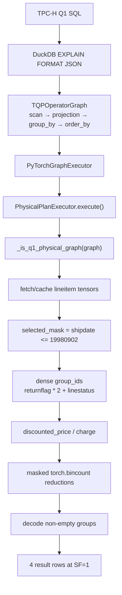

# TPC-H Q1 端到端执行链路：SQL → DuckDB JSON Plan → TQPOperatorGraph → PyTorch Backend

本文档解释当前 `torch-query-gpu` 仓库的真实执行链路：SQL 如何进入前端、如何通过 DuckDB/Sirius-like pipeline 变成 `TQPOperatorGraph`，后端如何把 graph 调度到 PyTorch tensor 算子，以及 TPC-H Q1 当前实际走到哪些代码。

> 关键结论：默认 `sirius` 前端下，Q1 不是手工 JSON，也不是直接调用 DuckDB 查询结果；它从原始 SQL 出发，经 DuckDB `EXPLAIN (FORMAT JSON)` 生成 physical plan，lowering 成 `TQPOperatorGraph`，最后由 PyTorch backend 在 CPU/CUDA tensor 上执行。DuckDB 负责 parser/binder/planner/metadata、base table column 读取和 validation baseline；它不作为整条查询的执行 fallback。

## 1. 总览

默认端到端链路如下：

```mermaid
flowchart LR
    SQL["SQL 文本<br/>--query / --sql / --sql-file"] --> Runner["runner.load_sql()"]
    Runner --> Run["run_sql_with_frontend()"]
    Run --> Compile["compile_tqp_plan()"]
    Compile --> Sirius["compile_sirius_plan()"]
    Sirius --> DuckDB["DuckDB parser / binder / planner<br/>EXPLAIN + EXPLAIN FORMAT JSON"]
    DuckDB --> Lower["lower_duckdb_json_to_operator_graph()"]
    Lower --> Plan["TQPPlan<br/>operator_graph=TQPOperatorGraph"]
    Plan --> Backend["PyTorchBackend.execute()"]
    Backend --> GraphExec["PyTorchGraphExecutor.execute()"]
    GraphExec --> Physical["execute_physical_plan()"]
    Physical --> Fusion["physical_fusion hook<br/>Q1 canonical shape"]
    Fusion --> Torch["PyTorch tensor operators<br/>torch.bincount / arithmetic / masks"]
    Torch --> Rows["list[dict] result rows"]
```



这条链路有几个边界：

1. **SQL 输入边界**：CLI 或 Python API 接收原始 SQL；TPC-H `--query 1` 也是先从 DuckDB TPC-H catalog 读出标准 SQL。
2. **Frontend 边界**：DuckDB/Sirius-like 前端负责解析、绑定、优化、导出计划和准入；执行阶段只从 DuckDB 文件读取 base table columns，不把 DuckDB 的整条查询结果交给 PyTorch。
3. **IR 边界**：`TQPPlan` 是前后端共享的不可变计划对象；其中 `operator_graph` 是后端真正执行的 graph。
4. **Backend 边界**：`PyTorchBackend` 只消费 `TQPPlan`；TPC-H Q1-Q22 必须带有 frontend-lowered `TQPOperatorGraph`。
5. **Tensor 执行边界**：`backend/physical*.py` 把 DuckDB physical node 解释为列式 tensor relation；Q1 canonical shape 会被 fused primitive 接管。

## 2. SQL 如何进入系统

CLI 入口包括：

- `tpch-torch-run` → `scripts/run_query.py`
- `tpch-torch-validate` → `scripts/validate_query.py`
- `tpch-torch-benchmark` → `scripts/benchmark_query.py`

三种 SQL 来源互斥：

```bash
tpch-torch-run --db data/tpch_sf1.duckdb --query 1 --device cuda
tpch-torch-run --db data/tpch_sf1.duckdb --sql "select count(*) from lineitem" --device cuda
tpch-torch-run --db data/tpch_sf1.duckdb --sql-file queries/my.sql --device cuda
```

代码入口在 `tpch_torch/runner.py`：

```python
def load_sql(con, query=None, sql=None, sql_file=None) -> str:
    sources = [query is not None, sql is not None, sql_file is not None]
    if sum(sources) != 1:
        raise ValueError("exactly one of query, sql, or sql_file is required")
    if query is not None:
        return get_tpch_query(con, query)
    if sql is not None:
        return sql
    return sql_file.read_text()
```

`run_sql_with_frontend()` 是端到端执行的薄编排层：

```python
def run_sql_with_frontend(con, sql, device="cpu", frontend="sirius", use_compressed_masks=False):
    _validate_device(device)
    plan = compile_tqp_plan(con, sql, frontend)
    rows = PyTorchBackend().execute(
        con,
        plan,
        device=device,
        use_compressed_masks=use_compressed_masks,
    )
    return QueryResult(query_id=plan.query_id, rows=rows)
```

注意这里先编译 `TQPPlan`，再调用 PyTorch backend。`validate_sql_with_frontend()` 会额外调用 DuckDB 执行同一 SQL 做正确性比较，但 validation baseline 不参与 PyTorch 输出。

## 3. Frontend：DuckDB/Sirius-like pipeline 做什么

默认前端是 `sirius`。它借鉴 Sirius 的工程取舍：复用 DuckDB 成熟的 SQL parser、binder、optimizer 和 physical planner，把 DuckDB 结构化计划 lowering 到本项目的 TQP graph；后端仍由本项目的 PyTorch tensor executor 执行。

核心代码在 `tpch_torch/frontend/sirius.py`：

```python
def compile_sirius_plan(con, sql: str) -> TQPPlan:
    duckdb_plan = export_duckdb_logical_plan(con, sql)
    query_id = identify_tpch_query(sql)  # Q1 会识别为 1；generic SQL 为 None
    physical_plan_json = export_duckdb_physical_plan_json(con, sql)
    operator_graph = lower_duckdb_json_to_operator_graph(sql, query_id, physical_plan_json)
    return TQPPlan(
        query_id=query_id,
        source_sql=sql,
        frontend="sirius",
        duckdb_metadata=DuckDBPlanMetadata(...),
        operator_graph=operator_graph,
    )
```

其中 `export_duckdb_physical_plan_json()` 直接对原始 SQL 调用 DuckDB：

```python
con.execute("PRAGMA explain_output='physical_only'")
rows = con.execute(f"EXPLAIN (FORMAT JSON) {sql}").fetchall()
```

这一步得到的是 DuckDB physical plan JSON。它不是手工构造的 JSON，也不是 DuckDB 查询结果。

## 4. DuckDB JSON 如何 lowering 成 TQPOperatorGraph

lowering 代码在 `tpch_torch/duckdb_plan_json.py`。它递归遍历 DuckDB JSON physical nodes，并把每个 DuckDB node 映射成后端可见的 `TQPOperatorNode`：

```python
def lower_duckdb_json_to_operator_graph(source_sql, query_id, plan_json):
    nodes = []

    def lower_node(raw_node, path):
        node_id = _node_id(path)
        child_ids = tuple(lower_node(child, (*path, i)) for i, child in enumerate(raw_node.get("children") or ()))
        name = str(raw_node.get("name", "UNKNOWN")).strip()
        nodes.append(TQPOperatorNode(
            node_id=node_id,
            kind=_operator_kind(name),
            name=name,
            children=child_ids,
            metadata=dict(raw_node.get("extra_info") or {}),
        ))
        return node_id

    root_id = lower_node(plan_json[0], (0,))
    return TQPOperatorGraph(source_sql=source_sql, query_id=query_id, root_id=root_id, nodes=tuple(nodes))
```

`_operator_kind()` 只做 coarse-grained 分类，保留 DuckDB 原始 `name` 与 `extra_info`，例如：

| DuckDB physical node | `OperatorKind` | metadata 用途 |
| --- | --- | --- |
| `SEQ_SCAN` | `SCAN` | 表名、投影列、scan filters |
| `FILTER` | `FILTER` | filter expression |
| `PROJECTION` | `PROJECT` | projection expressions |
| `HASH_JOIN` / `NESTED_LOOP_JOIN` | `JOIN` | join type、conditions |
| `PERFECT_HASH_GROUP_BY` / `HASH_GROUP_BY` / `UNGROUPED_AGGREGATE` | `AGGREGATE` | groups、aggregate specs |
| `ORDER_BY` | `SORT` | order keys |
| `TOP_N` / `LIMIT` | `LIMIT` | top/limit、order keys |

IR 类型定义在 `tpch_torch/operator_graph.py`：

```python
@dataclass(frozen=True)
class TQPOperatorNode:
    node_id: str
    kind: OperatorKind
    name: str
    children: tuple[str, ...] = ()
    metadata: Mapping[str, Any] = field(default_factory=dict)

@dataclass(frozen=True)
class TQPOperatorGraph:
    source_sql: str
    query_id: int | None
    root_id: str
    nodes: tuple[TQPOperatorNode, ...]
```

这里的 graph 是 immutable 的前后端边界；后端的执行逻辑来自 graph 和 metadata。`source_sql` 仍会用于输出别名、projection alias 和 validation 描述，但不会被当作 DuckDB 查询结果 fallback。

## 5. Q1 的 DuckDB physical graph 长什么样

对 SF=1 数据库运行：

```python
from tpch_torch.duckdb_bridge import connect_database
from tpch_torch.runner import load_sql, compile_tqp_plan

con = connect_database("data/tpch_sf1.duckdb")
sql = load_sql(con, query=1)
plan = compile_tqp_plan(con, sql, "sirius")
for node in plan.operator_graph.nodes:
    print(node.node_id, node.name, node.kind, node.children, node.metadata)
```

当前 Q1 graph 的关键节点形状如下（省略部分 metadata）：

```text
SEQ_SCAN lineitem
  Projections: l_returnflag, l_linestatus, l_quantity, l_extendedprice, l_discount, l_tax
  Filters: l_shipdate <= '1998-09-02'::DATE
→ PROJECTION
  l_returnflag, l_linestatus, l_quantity, l_extendedprice,
  l_extendedprice * (1.00 - l_discount), l_tax, l_discount
→ PROJECTION
  __internal_compress_string_utinyint(#0), __internal_compress_string_utinyint(#1), ...
→ PROJECTION
  #4 * (1.00 + l_tax), plus aggregate input columns
→ PERFECT_HASH_GROUP_BY
  Groups: #0, #1
  Aggregates:
    sum_no_overflow(#2), sum_no_overflow(#3), sum_no_overflow(#4), sum_no_overflow(#5),
    avg(#6), avg(#7), avg(#8), count_star()
→ PROJECTION / ORDER_BY / PROJECTION
  decompress returnflag/linestatus, order by returnflag ASC, linestatus ASC
```

这对应 TPC-H Q1 的语义：

1. 扫描 `lineitem`。
2. 过滤 `l_shipdate <= DATE '1998-09-02'`。
3. 计算折后价 `l_extendedprice * (1 - l_discount)` 和含税价。
4. 按 `(l_returnflag, l_linestatus)` 分组。
5. 计算 `sum`、`avg`、`count`。
6. 按两个分组 key 排序输出。

## 6. PyTorchBackend 如何调度 graph

后端入口在 `tpch_torch/backend/pytorch.py`：

```python
class PyTorchBackend:
    def execute(self, con, plan, device="cpu", use_compressed_masks=False):
        if plan.operator_graph is not None:
            return PyTorchGraphExecutor().execute(
                con,
                plan,
                device=device,
                use_compressed_masks=use_compressed_masks,
            )
        if plan.query_id is not None:
            raise UnsupportedPlanError(
                f"TPC-H Q{plan.query_id} requires a frontend-lowered TQP operator graph"
            )
        return PyTorchGraphExecutor().execute(con, plan, device=device, use_compressed_masks=use_compressed_masks)
```

这段代码表达了当前后端契约：

- TPC-H 查询不能没有 `operator_graph`。
- 旧的 `COMPILED_TPCH` compatibility root 不再作为执行 fallback。
- generic SQL 如果已经 lowering 出 DuckDB physical graph，也会进入 physical interpreter。

`PyTorchGraphExecutor` 继续分发：

```python
if graph is None:
    if plan.generic_plan is not None:
        return execute_generic_sql_plan(con, plan.generic_plan, device=device)
    raise UnsupportedPlanError("TQP operator graph is required for PyTorch graph execution")

if plan.query_id is None:
    return execute_physical_plan(con, graph, device=device)

if plan.query_id == 6 and use_compressed_masks:
    return _execute_q6_graph(con, device, use_compressed_masks)
if plan.query_id in _PHYSICAL_TPCH_QUERIES:  # Q1-Q22
    return execute_physical_plan(con, graph, device=device)
```

所以默认 Q1 路径是：

```text
TQPPlan.operator_graph
→ PyTorchGraphExecutor._execute_tpch_graph()
→ execute_physical_plan(con, graph, device)
```

## 7. Physical interpreter：把 DuckDB node 解释成 tensor relation

`tpch_torch/backend/physical.py` 中的 `PhysicalPlanExecutor` 是当前 TPC-H Q1-Q22 和 generic join/aggregate 的主要后端。它的执行模型类似一个后序 DFS：先执行 child nodes，再执行 parent node。

入口：

```python
class PhysicalPlanExecutor:
    def execute(self):
        fused_rows = physical_fusion.try_execute_fused_physical_plan(self._con, self._graph, self._device)
        if fused_rows is not None:
            return fused_rows
        table = self._execute_node(self._graph.root_id)
        aliases = _describe_aliases(self._con, self._graph.source_sql)
        table = _trim_to_output_arity(table, len(aliases))
        return _rows_from_table(_rename_for_output(table, aliases))
```

普通解释路径中的 node dispatch：

```python
if node.kind == OperatorKind.SCAN:
    return self._execute_scan(node)
if node.kind == OperatorKind.FILTER:
    return self._execute_filter(node)
if node.kind == OperatorKind.PROJECT:
    return self._execute_projection(node)
if node.kind == OperatorKind.JOIN:
    return self._execute_join(node)
if node.kind == OperatorKind.AGGREGATE:
    return self._execute_aggregate(node)
if node.kind == OperatorKind.SORT:
    return self._execute_sort(node)
```

在 interpreter 内部，relation 的表示是 `PhysicalTable`：

```python
@dataclass(frozen=True)
class PhysicalValue:
    tensor: torch.Tensor | None = None
    dictionary: tuple[str, ...] | None = None
    is_date: bool = False
    literal: int | float | str | bool | None = None
    valid: torch.Tensor | None = None

@dataclass(frozen=True)
class PhysicalTable:
    name: str
    columns: Mapping[str, PhysicalValue]
    order: tuple[str, ...]
    row_count: int
```

可以把它理解成“列式 tensor relation”：

- 每列是一个 `torch.Tensor`。
- 字符串列通常 dictionary encode 成 int ids，`dictionary` 保存解码表。
- 日期列编码为 `YYYYMMDD` integer。
- outer join / mark join 等需要 null 语义时，用 `valid` mask 表示有效性。
- `order` 记录当前 relation 的输出列顺序。

## 8. PyTorch 算子长什么样

普通 physical path 的算子分散在 `backend/physical*.py` 中，它们不是 TPC-H 专用 Python 脚本，而是由 DuckDB physical node metadata 驱动的 tensor primitives。

### 8.1 Scan：DuckDB 列 → torch.Tensor

`_execute_scan()` 读取 DuckDB scan metadata 中的 table、projection 和 filter columns，然后取列并编码：

```python
columnar = con.execute(f"select {select_list} from {table_name}").fetchnumpy()
for column in fetched_columns:
    tensor, vocabulary = _encode_generic_column(columnar[column], device, column_name=column, table_name=table_name)
    values[column] = PhysicalValue(tensor=tensor, dictionary=vocabulary, is_date=column in DATE_COLUMNS_EXTENDED)
```

### 8.2 Filter / expression：tensor mask

`physical_expr.evaluate_expression()` 把 DuckDB scalar expression 映射成 tensor 运算：

```python
if operator == "+":
    return PhysicalValue(tensor=left_tensor + right_tensor, valid=valid)
if operator == "-":
    return PhysicalValue(tensor=left_tensor - right_tensor, valid=valid)
if operator == "*":
    return PhysicalValue(tensor=left_tensor * right_tensor, valid=valid)
if operator == "/":
    return PhysicalValue(tensor=left_tensor / right_tensor, valid=valid)
```

比较、布尔表达式、`IN`、`LIKE` 等也返回 bool tensor：

```python
return PhysicalValue(tensor=left_tensor <= right_tensor, valid=valid)
return PhysicalValue(tensor=torch.logical_not(_bool_tensor(...)))
return PhysicalValue(tensor=membership_mask(tensor, values))
```

`PhysicalTable.filter(mask)` 最终做列式 selection：

```python
return PhysicalTable(
    name or self.name,
    _transform_unique_values(self.columns, lambda value: value.filter(mask)),
    self.order,
    int(mask.sum().cpu().item()),
)
```

### 8.3 Project：表达式 materialization

Projection 对 DuckDB `Projections` metadata 中的每个表达式调用 `evaluate_expression()`，生成新的 `PhysicalTable.projected(...)`。

```python
for index, expression in enumerate(expressions):
    value = evaluate_expression(child, value_expression)
    name, aliases = projection_output_name(child, expression, index, value, self._select_aliases)
    items.append((name, value, aliases))
return PhysicalTable.projected("projection", items, child.row_count)
```

### 8.4 Aggregate：unique group id + scatter/index_add

普通 grouped aggregate path 在 `physical_aggregate.py`：

```python
stacked = torch.stack(key_tensors, dim=1)
unique_keys, inverse = _unique_group_keys(stacked)
```

如果输入 group keys 已经按字典序有序，会走 `torch.unique_consecutive` fast path；否则走 `torch.unique(..., return_inverse=True)`。

聚合实现使用 `index_add` 或 `scatter_reduce`：

```python
def _scatter_sum(values, group_ids, group_count):
    result = torch.zeros(group_count, dtype=values.dtype, device=values.device)
    return result.index_add(0, group_ids.to(dtype=torch.int64), values)

def _scatter_reduce(values, group_ids, group_count, reduce):
    result = torch.full((group_count,), fill_value, dtype=values.dtype, device=values.device)
    return result.scatter_reduce(0, group_ids.to(dtype=torch.int64), values, reduce=reduce, include_self=True)
```

### 8.5 Join：sort/searchsorted + gather

Join row-index 生成在 `physical_join.py`：

```python
right_order, sorted_right_values = _sorted_build_keys(right_values)
starts = torch.searchsorted(sorted_right_values, left_values, right=False)
ends = torch.searchsorted(sorted_right_values, left_values, right=True)
match_counts = ends - starts
```

唯一 build key 时可以直接生成一对一 indices；非唯一时用 `torch.repeat_interleave` 展开匹配行。最终 `combine_join_tables()` 对左右表做 `gather()` 组装 join 输出。

## 9. Q1 为什么有 fused physical primitive

Q1 的普通 physical path 可以由 scan/filter/project/group/order 解释出来，但它会产生较多中间 materialization，并且 grouped aggregate 需要通用 unique/scatter 流程。Q1 是 TPC-H 和 TQP 论文中最重要的 scan-heavy baseline，因此当前后端在不绕过 SQL lowering 的前提下增加了 graph-lowered fusion hook：

```python
def try_execute_fused_physical_plan(con, graph, device):
    if _is_q1_physical_graph(graph):
        return _execute_q1_fused(con, device)
    return None
```

识别条件仍基于 frontend-lowered graph：

```python
def _is_q1_physical_graph(graph):
    if graph.query_id != 1:
        return False
    node_names = {node.name.strip().upper() for node in graph.nodes}
    if "PERFECT_HASH_GROUP_BY" not in node_names and "HASH_GROUP_BY" not in node_names:
        return False
    if "ORDER_BY" not in node_names:
        return False
    scan_tables = {str(node.metadata.get("Table", "")).lower() for node in graph.nodes if node.name.strip().upper().endswith("SCAN")}
    return "lineitem" in scan_tables
```

这意味着 Q1 fusion 不是 `if query_id == 1` 后直接跑一个孤立脚本；它仍要求 DuckDB JSON physical graph 中出现 Q1 应有的 scan/group/order shape。

## 10. Q1 fused PyTorch 执行细节

Q1 fused path 在 `tpch_torch/backend/physical_fusion.py`：

```python
def _execute_q1_fused(con, device):
    table = fetch_lineitem_tensor_table(con, device=device)
    selected_mask = table.columns["l_shipdate"] <= 19980902
    status_count = len(table.dictionaries["l_linestatus"])
    flag_count = len(table.dictionaries["l_returnflag"])
    group_ids = _q1_group_ids(table, status_count)
    aggregates = _q1_grouped_reductions(table.columns, selected_mask, group_ids, flag_count * status_count)
    non_empty_group_ids = torch.nonzero(aggregates["count_order"] > 0).flatten()
    compacted = {name: tensor[non_empty_group_ids] for name, tensor in aggregates.items()}
    keys = torch.stack((non_empty_group_ids // status_count, non_empty_group_ids % status_count), dim=1)
    return _format_q1_rows(table, keys, compacted)
```

Q1 需要的列通过 `fetch_lineitem_tensor_table()` 一次性取出并编码：

```sql
select
    case l_returnflag when 'A' then 0 when 'N' then 1 when 'R' then 2 end::bigint as l_returnflag,
    case l_linestatus when 'F' then 0 when 'O' then 1 end::bigint as l_linestatus,
    l_quantity::double,
    l_extendedprice::double,
    l_discount::double,
    l_tax::double,
    strftime(l_shipdate, '%Y%m%d')::integer as l_shipdate
from lineitem
```

然后变成 `TensorTable`：

```python
columns = {
    "l_returnflag": torch.as_tensor(columnar["l_returnflag"], dtype=torch.int64, device=device),
    "l_linestatus": torch.as_tensor(columnar["l_linestatus"], dtype=torch.int64, device=device),
    "l_quantity": torch.as_tensor(columnar["l_quantity"], dtype=torch.float64, device=device),
    "l_extendedprice": torch.as_tensor(columnar["l_extendedprice"], dtype=torch.float64, device=device),
    "l_discount": torch.as_tensor(columnar["l_discount"], dtype=torch.float64, device=device),
    "l_tax": torch.as_tensor(columnar["l_tax"], dtype=torch.float64, device=device),
    "l_shipdate": torch.as_tensor(columnar["l_shipdate"], dtype=torch.int32, device=device),
}
```

为了让 hot query 更接近 TQP 论文中“输入列已经是 PyTorch tensors 后测 execution time”的口径，Q1 lineitem tensor table 有 per-connection/per-device resident cache：

```python
_LINEITEM_TENSOR_TABLE_CACHE: weakref.WeakKeyDictionary[Any, dict[str, TensorTable]]
```

同一 DuckDB connection 和同一 device 的 warmup/hot runs 会复用已转换 tensor。

## 11. Q1 的实际 tensor 公式

Q1 的分组 key 是两个低基数字符串列：

- `l_returnflag` dictionary：`("A", "N", "R")`
- `l_linestatus` dictionary：`("F", "O")`

因此 dense group id 可以直接编码为：

```python
group_ids = l_returnflag * status_count + l_linestatus
# status_count = 2，所以最多 3 * 2 = 6 个 dense groups
```

过滤条件：

```python
selected_mask = l_shipdate <= 19980902
mask_weights = selected_mask.to(dtype=quantity.dtype)
```

表达式：

```python
discounted_price = l_extendedprice * (1.0 - l_discount)
charge = discounted_price * (1.0 + l_tax)
```

聚合使用 masked `torch.bincount`，避免先 gather selected rows 再聚合：

```python
count_order = torch.bincount(group_ids, weights=mask_weights, minlength=group_count)
sum_qty = torch.bincount(group_ids, weights=l_quantity * mask_weights, minlength=group_count)
sum_base_price = torch.bincount(group_ids, weights=l_extendedprice * mask_weights, minlength=group_count)
sum_disc_price = torch.bincount(group_ids, weights=discounted_price * mask_weights, minlength=group_count)
sum_charge = torch.bincount(group_ids, weights=charge * mask_weights, minlength=group_count)
avg_qty = sum_qty / count_order
avg_price = sum_base_price / count_order
avg_disc = sum_discount / count_order
```

最后只保留 `count_order > 0` 的 groups，并把 tiny grouped result 拷回 CPU 解码为 Python rows：

```python
host_keys = keys.cpu()
host_aggregates = {name: tensor.cpu() for name, tensor in aggregates.items()}
row = {
    "l_returnflag": table.decode_value("l_returnflag", int(host_keys[index, 0])),
    "l_linestatus": table.decode_value("l_linestatus", int(host_keys[index, 1])),
    ...
}
```

Q1 的融合执行图：



## 12. Q1 实际执行与验证方式

验证 Q1 走完整链路：

```bash
tpch-torch-validate \
  --db data/tpch_sf1.duckdb \
  --query 1 \
  --device cuda \
  --frontend sirius
```

无 CUDA 时可使用 `--device cpu`。如果显式指定 `--device cuda` 且 PyTorch 检测不到 CUDA，系统会直接报错，不会静默退回 CPU。

运行 Q1 并打印结果：

```bash
tpch-torch-run \
  --db data/tpch_sf1.duckdb \
  --query 1 \
  --device cuda \
  --frontend sirius \
  --json
```

性能计时建议使用冷/热 benchmark：

```bash
tpch-torch-benchmark \
  --db data/tpch_sf1.duckdb \
  --query 1 \
  --device cuda \
  --frontend sirius \
  --cold-runs 1 \
  --warmup-runs 1 \
  --hot-runs 5
```

计时语义：

- **cold**：每个样本新建 DuckDB connection，包含 frontend、DuckDB→tensor/GPU conversion、PyTorch execution、result materialization。
- **hot**：复用同一个 DuckDB connection；Q1 会复用 resident lineitem tensors，更接近 TQP 论文中 “data already converted to PyTorch tensors” 的 execution-time 口径。
- **CUDA**：每个样本前后同步 CUDA，报告 wall-clock ms。

README 中记录的最近一次 Q1 SF=1 smoke benchmark 为：

| 路径 | device | cold median | hot median | 说明 |
| --- | --- | ---: | ---: | --- |
| Q1 resident + masked `bincount` | CPU | 943.278 ms | 198.580 ms | hot 复用 resident tensors |
| Q1 resident + masked `bincount` | CUDA | 719.700 ms | 12.365 ms | cold 包含首次 DuckDB→GPU tensor conversion |

这些数字是端到端 wall-clock smoke benchmark，不是论文表格中的严格复现实验。论文的 Q1 口径通常假设输入列已离线转换成 tensor；因此对比时应重点看 hot/resident 结果，同时保留 cold 指标暴露 ingestion 和 transfer 成本。

## 13. 与“直接 PyTorch 脚本”的区别

当前 Q1 虽然有 fused primitive，但它仍满足项目当前目标的编译链路：

```text
原始 SQL
→ DuckDB physical plan JSON
→ TQPOperatorGraph
→ PyTorchGraphExecutor
→ PhysicalPlanExecutor / graph-lowered fusion
→ PyTorch tensor operators
```

它不是以下形式：

```text
if query_id == 1:
    直接忽略 SQL / 忽略 DuckDB plan / 手写返回 rows
```

判断依据：

1. Q1 必须先通过 `compile_sirius_plan()` 得到 `operator_graph`。
2. backend 拒绝 TPC-H 无 graph 的 plan。
3. Q1 fusion hook 会检查 graph 中的 `GROUP_BY`、`ORDER_BY` 和 `lineitem` scan shape。
4. 输出 rows 由 PyTorch tensor reductions 计算得到；DuckDB 只在 validation 中提供 baseline。

## 14. 不支持形状如何失败

当前项目遵循“显式失败，不静默 fallback”原则：

- DuckDB 无法 parse/plan 的 SQL，会在 frontend 阶段失败。
- DuckDB JSON physical node 无对应 PyTorch interpreter，会抛 `UnsupportedPlanError`。
- TPC-H plan 如果没有 frontend-lowered graph，会抛 `UnsupportedPlanError`。
- strict Substrait 路径只运行 DuckDB native Substrait exporter 能导出的 SQL；导不出时显式失败，不自动切到 Sirius-like。

因此 validation 结果可信：如果 PyTorch 后端输出通过 DuckDB baseline 校验，说明当前支持的 graph path 真正执行了；如果不支持，会暴露错误而不是伪造成功。
